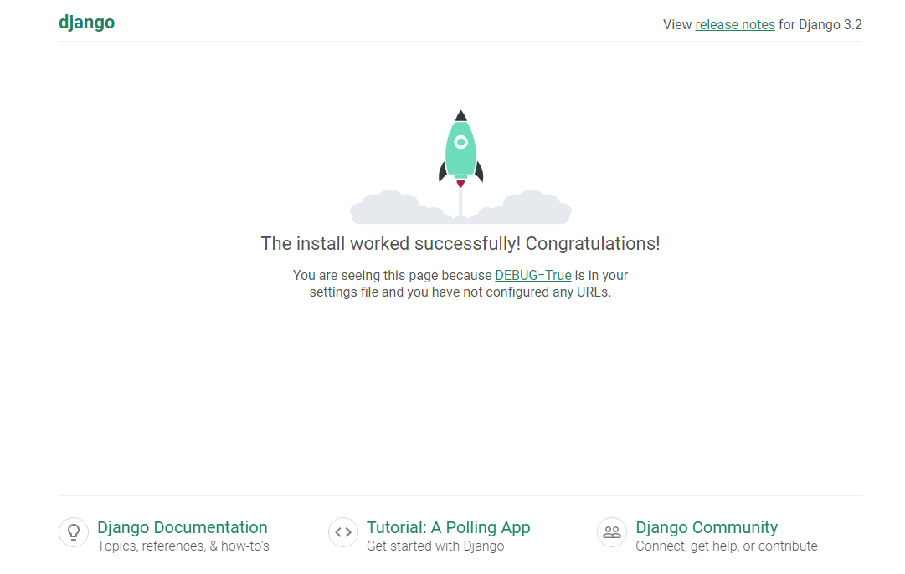

# VERA'S RECLAIMED TREASURES

Vera's Reclaimed Treasures is an educational fullstack website based on business logic used to control a centrally owned dataset.  It has an authentication mechanism and provides paid access based on the dataset in the purchasing of products.

_____

## Table of Contents

* [Overview]()
* [Planning & Research]()
* [Agile Methodology]()
* [Visual Design]()
* [Features]()
* [Testing]()
* [Deployment](#deployment)
* [Bugs](#bugs) <!-- Temporary -->
* [Technologies]()
* [Credits]()
* [Acknowledgments]()

[Back to Top](#table-of-contents)

_______

# Deployment

This project was developed in [CodeAnywhere](https://app.codeanywhere.com/) Cloud IDE using [Code Institute's Full Template](https://github.com/Code-Institute-Org/ci-full-template).  The following describes the process undertaken to set up the Django project using a postgreSQL database instance on [ElephantSQL](https://www.elephantsql.com/), an [Amazon AWS S3 Bucket](https://aws.amazon.com/) for media and static file storage and deployment to [Heroku](https://www.heroku.com/).  

## Setup

1. Create a new GitHub repository using the [Code Institute's Full Template](https://github.com/Code-Institute-Org/ci-full-template) which preinstalls all the tools needed to get started.  If you do not have access to this you need to pre-install Python and all requirements into your IDE.
2. Once your repository has been created on GitHub, copy the repository URL and log into [CodeAnywhere](https://app.codeanywhere.com/) with your GitHub account.
3. Click on the 'New Workspace' button on your dashboard and paste in the copied repository URL.  Click 'Create'. This will create your new workspace which can be accessed from the [CodeAnywhere Dashboard](https://app.codeanywhere.com/).
4. In your new workspace navigate to the 'Terminal' tab in the top menu and click on 'New Terminal'. This will open a terminal at the bottom of the workspace where you can run the following commands to install Django and supporting libraries.
   * `pip3 install 'django<4' gunicorn`  - This installs [Django 3.2](https://www.djangoproject.com/start/overview/) and the server [gunicorn](https://gunicorn.org/) used to run the project on Heroku.
   * `pip3 install dj_database_url==0.5.0 psycopg2`  - This installs the [postgreSQL](https://www.postgresql.org/) relational database management system along with [psycopg2](https://www.psycopg.org/docs/) and adapter for Python.
   * `pip3 freeze --local > requirements.txt`  - This creates the requirements.txt file and adds Django and the installed supporting libraries to it.
5. Create a new Django project and give it the name of the website. `django-admin startproject project_directory .`  - Don't forget the (.) dot to create the project in the current directory.
6. Create the first app. I started with the home app. `python3 manage.py startapp home`
7. Add the new app to the INSTALLED_APPS in settings.py.

   ```python
   INSTALLED_APPS = [
        'django.contrib.admin',
        'django.contrib.auth',
        'django.contrib.contenttypes',
        'django.contrib.sessions',
        'django.contrib.messages',
        'django.contrib.staticfiles',
        #  Custom apps
        'home',
    ]
    ```

8. Create a basic .gitignore file `touch .gitignore` (you might already have this if you're using CI's Full Template). Then add:
   * `*.sqlite3`  - so as not to commit the development database to version control.
   * `.pyc` and `__pycache__`  - to ignore compiled Python code not needed in version control.
9. Run the project to make sure that everything is working properly using the `python3 manage.py runserver` command and exposing port 8000. If working on CodeAnywhere, you may get a 'DisallowedHost at /' error.  Copy the URL of your running CodeAnywhere project to the ALLOWED_HOSTS variable in settings.py and run it again. `ALLOWED_HOSTS = ['8000-githubusername-gitrepositoryname-abcde12fgh.us2.codeanyapp.com']` - Do not add the 'https://' at the start or the trailing '/' at the end. You should now get the 'Install worked successfully' page below.

10. Stop the server ('ctrl + c' on windows, 'cmd + .' on mac) and run the initial migrations using the `python3 manage.py migrate` in the terminal.
11. Create a superuser so that you can log in to the Admin panel. `python3 manage.py createsuperuser` and enter your username, email and password. The skeleton of the project is now complete.

## Setup for First Deployment

With the skeleton of the project running locally, it is best to prepare it for deployment on Heroku at this early stage.

### Create the Heroku App

1. Login to [Heroku](https://www.heroku.com/) and click on the top right button ‘New’ on the dashboard.
2. Click 'Create new app'.
3. Give your app a unique name and select the region closest to you.
4. Click on the 'Create app' button.

### Create the postgreSQL Database

Since the database provided by Django is only accessible within Gitpod, a new database suitable for production needs to be created in order for Heroku to be able to access it.  The following steps create a new postgreSQL database instance, hosted on [ElephantSQL](https://www.elephantsql.com/).

1. Login to ElephantSQL and click on the top right button 'Create New Instance'.
2. Give your plan the name of the project and select the Tiny Turtle (Free) plan.  The 'Tags' field can be left empty.
3. Click on 'Select Region'. Select a data centre near you.  Choose another region if there is none in your region yet. Click 'Review'.
4. Make sure your plan is correct and click 'Create Instance'.
5. Return to the dashboard and click on this project's instance you just created. This will open up the 'Details' page where the link to the URL is displayed.  This needs to be added to the env.py file in the project's directories as well as to the Heroku Config Vars so copy it and keep this tab open.

### Create an env.py file

With the database created, it now needs to be connected with the project.  Certain variables need to be kept private and should not be published to GitHub.  In order to keep these variables hidden, it is important to create an env.py file and add it to .gitignore.  

1. Run the `touch env.py` command in the terminal to create the env.py file.
2. Import os and set the DATABASE_URL variable using the `os.environ` method and add the URL copied from instance created above to it here, like so: `os.environ[“DATABASE_URL”] = ”postgres://ElephantSQLcopiedURL”`
3. The Django application requires a SECRET_KEY to encrypt session cookies.  Set this variable to any string you like or generate a secret key on this [MiniWebTool](https://miniwebtool.com/django-secret-key-generator/).
   `os.environ[“SECRET_KEY”] = ”longSecretString”`

### Modify settings.py

It is important to make the Django project aware of the env.py file and to connect the workspace to the new database.

1. Open up the settings.py file and add the following code. The if statement acts as a safety net for the application in case it is run without the env.py file.

    ```python
    import os  
    import dj_database_url  

    if os.path.isfile('env.py'):
        import env
    ```

2. Remove the insecure secret key provided by Django further down and reference the variable in the env.py file, like so:

    ```python
    SECRET_KEY = os.environ.get('SECRET_KEY')
    ```

3. Hook up the database using the dj_database_url import added above.  Comment out the original DATABASES variable provided by Django which connects the Django application to the created db.sqlite3 database within your repo.  This database is not suitable for production so add the following code instead:

    ```python
    DATABASES = {
        'default': dj_database_url.parse(os.environ.get('DATABASE_URL'))
    } 
    ```

    Note: If you prefer to work with the db.sqlite3 one in development then use the following code to use it if the external database is not yet hooked up.

    ```python
    if 'DATABASE_URL' in os.environ:
        DATABASES = {
            'default': dj_database_url.parse(os.environ.get('DATABASE_URL'))
        }
    else:
        DATABASES = {
            'default': {
                'ENGINE': 'django.db.backends.sqlite3',
                'NAME': BASE_DIR / 'db.sqlite3',
            }
        }
    ```

4. Save and migrate this database structure to the newly connected postgreSQL database.  Run the migrate command `python3 manage.py migrate` in your terminal.

5. To make sure the application is now connected to the remote database hosted on ElephantSQL, head over to your ElephantSQL dashboard and select the newly created database instance. Select the 'Browser' tab on the left and click on 'Table queries'.  This displays a dropdown field with the database structure which has been populated from the Django migrations. If you select 'auth_user' and click on the 'Execute' button on the right, you should be able to see your superuser details displayed.  This confirms your tables have been created and you can add data to your database.

6. If you don't see your superuser details displayed run the `python3 manage.py createsuperuser` command again, give yourself a Username, email and password and go over step 5 above again.

### Connect the database to Heroku

1. Open up the Heroku dashboard, select the project's app and click on the 'Settings' tab.
2. Click on 'Reveal Config Vars' and add the DATABASE_URL with the value of the copied URL (without quotation marks) from the database instance created on ElephantSQL.
3. Also add the SECRET_KEY with the value of the secret key added to the env.py file.
4. If using GitPod another key needs to be added in order for the deployment to succeed.  This is PORT with the value of 8000.
5. To help get the project deployed without static files you need to add one more temporary variable.  This needs to be removed before deploying the full project.  Use DISABLE_COLLECTSTATIC as the key and '1' as the value.

### Setup the Templates directory

In settings.py scroll down to the TEMPLATES variable to instruct Django to store the root templates directory in the DIRS setting, like so:

```python
'DIRS' = [
    os.path.join(BASE_DIR, 'templates'),
]
```

This is where the custom allauth directory will also be set.

### Add Heroku Host Name

In settings.py scroll to ALLOWED_HOSTS and add the Heroku host name before the URL of your running CodeAnywhere project. This should be the Heroku app name created earlier followed by .herokuapp.com.
`ALLOWED_HOSTS = ['heroku-app-name.herokuapp.com', '8000-githubusername-gitrepositoryname-abcde12fgh.us2.codeanyapp.com']`

### Create the Process file

1. Create the media, static and templates directories at the root level next to the manage.py file.
2. At the root level again, create a new file called 'Procfile' with a capital 'P'. This tells Heroku how to run this project. In this file add the following code, including the name of your project directory. `web: gunicorn project_directory.wsgi:application`
    * 'web' tells Heroku that this a process that should accept HTTP traffic.
    * 'gunicorn' is the server used
    * 'wsgi' stands for web services gateway interface and is a standard that allows Python services to integrate with web servers

## First Deployment

Make sure everything is saved and pushed to GitHub before continuing on.

1. Go back to the Heroku dashboard and click on the 'deploy' tab.
2. For deployment method, select 'GitHub' and search for the project's repository from the list.
3. Select and then click on 'Deploy Branch'.
4. When the build log is complete it should say that the app has been successfully deployed.
5. Click on the 'Open App' button to view it and the Django “The install worked successfully!” page, should be displayed.

## Amazon Web Services Setup

[Amazon Web Services(AWS) S3](https://aws.amazon.com/) is a cloud-based storage service where we can store our static and media files. The following are the steps of how I set it up following a guide by one of CI's tutors. Please be aware that AWS might have updated their User Interface since these steps were written.  

### Creating the S3 Bucket

1. Navigate to [Amazon AWS](https://aws.amazon.com/) in the browser and login or create an account. Be aware that you will be asked to enter a credit card number which will be used for billing if you go above the free usage limits. Enter your details and billing information then select the basic support which is free and click on the 'Complete sign up' button. Head over to the AWS Management Console where you will be redirected to the sign in page.
2. Sign in using the root user.  Enter your email and password.
3. You will be directed to the Console Home. Navigate to S3 in the Services menu if you haven't accessed this service before.
4. Open S3 and create a new bucket to store the media and static files.  To keep things organised give it the same name as the Heroku app name and select the region closest to you.
5. In Object Ownership, select ACLs enabled and Bucket owner preferred.
6. In Block Public Access, uncheck Block all public access and acknowledge that the bucket will be public if you want to allow public access to the static files. Click 'Create bucket'.
7. Click the newly created bucket to set a few basic settings.  In the Properties tab, scroll down to Static website hosting, click 'Edit' and select Enable and Host a static website.
8. Enter a default value in the Index document field and click the 'Save changes' button at the bottom right.
9. In the Permissions tab, scroll down to the Cross-origin resource sharing (CORS) section and click the 'Edit' button. Paste in the following CORS configuration which will set up the required access with the Heroku app and save changes.

    ```json
    [
        {
            "AllowedHeaders": [
                "Authorization"
            ],
            "AllowedMethods": [
                "GET"
            ],
            "AllowedOrigins": [
                "*"
            ],
            "ExposeHeaders": []
        }
    ]
    ```

10. Still in the Permissions tab, go to the Bucket Policy section and click 'Edit'.  Click on 'Policy generator' to create a security policy for this bucket.
    * Select 'S3 Bucket Policy' for Type of Policy.
    * Add a (*) star symbol in the Principal field to allow all principals.
    * In the Actions dropdown select GetObject.
    * Copy the ARN from the orignal tab and paste it in the ARN input box provided.
    * Click 'Add Statement' then 'Generate Policy'.
    * Copy the policy that opens up in the modal and paste it in the Bucket Policy Editor from the original tab.
    * Add a slash star (/*) to the end of the Resource value in order to allow access to all resources in this bucket.
    * Save changes
11. To configure the bucket, go to the Access control list(ACL) section and select List for Everyone (public access). Accept the warning box and save changes.

### Creating AWS Groups, Policies and Users

1. In order to access the bucket, a user needs to be created through the Identity and Access Management Service (IAM). To open this, go back to the Services menu and click on IAM.  This will open the IAM Dashboard.
2. First you need to create a group for the user to live in.  Click on User groups in the left side bar, then click the 'Create Group' button on the top right. Give the group a meaningful name like "manage-project-name", then scroll down to the bottom and click 'Create Group'.
3. Next, create the policy used to access the bucket by clicking on Policy in the left side bar and then click the 'Create Policy' button. Click on the JSON tab and then on the 'Import managed policy' link.  This will open a modal.  Search for S3 and then select and import the "AmazonS3FullAccess" policy.
4. In order to allow full access to the bucket and everything within it, you need to get the bucket ARN from the bucket policy page in s3. To do this, open S3 in a separate tab, navigate to the bucket, click on the Properties tab and copy the ARN from the Bucket overview section.
5. Navigate back to the IAM Managment Console tab and paste in the ARN you just copied as the value of the key Resource.  Paste it again after a comma, adding the slash and star (/*) to add another rule for all files/folders in the bucket.

    ```json
    "Resource": [
        "arn:aws:s3:::bucket-name",
        "arn:aws:s3:::bucket-name/*"
    ]
    ```

6. Now that you have all S3 actions allowed both on the bucket and everything within it, click on 'Next: Tags' and 'Next: Review'.  Give the policy a name, e.g. "bucket-name-policy" and a description - "Access to S3 bucket for project-name static files".  Then click the 'Create policy" button.  This will take you back to the policies page where you can see the policy that has just been created.
7. To attach the policy to the group, click on User Groups in the left side bar, click on the group you just created and go to the Permissions tab.  Open the Add permissions dropdown and select 'Attach policies'. Select the policy and click the 'Add permissions' button at the bottom right.
8. Finally, create a user to put in the group by clicking on Users in the left side bar and then the 'Add users' button at the top right.  Create a user named something like "project-name-staticfiles-user" and click 'Next'.
9. In the Permissions options, select 'Add user to group' and the group you just created, then click the 'Next' button. Review and click the 'Create User' button.
10. In order to get the access key and secret access key which you'll use to authenticate them from the Django app, click on the user and then on the Security Credentials tab.  Scroll down to Access Keys and click on 'Create access key'.  Choose 'Other' and click next.  Give your access key a description tag to facilitate rotating this access key confidentially later, e.g. project-name-django-app, and click 'Create access key'. You can now download the CSV file containing the users and secret access keys, which you will need to authenticate from the Django app.

### Connecting Django to S3

1. To connect Django to S3, you need to install boto3 `pip3 install boto3` and django-storages `pip3 install django-storages`.  Add to requirements and add `storages` to the INSTALLED_APPS in settings.py.
2. Here you also need to add the following to tell Django which bucket it should be communicating with.  You only want to do this on Heroku so add an if statement and configure your bucket.

   ```python
   if 'USE_AWS' in os.environ:
        #  Bucket Config
        AWS_STORAGE_BUCKET_NAME = 'your-bucket-name'
        AWS_S3_REGION_NAME = 'your-chosen-region'
        AWS_ACCESS_KEY_ID = os.environ.get('AWS_ACCESS_KEY_ID')
        AWS_SECRET_ACCESS_KEY = os.environ.get('AWS_SECRET_ACCESS_KEY')
    ```

3. Make sure to add the last two in your env.py file in order to keep them secret. You will find these in the CSV file you downloaded earlier.

    ```python
    os.environ["AWS_ACCESS_KEY_ID"] = "yourAccessKeyId"
    os.environ["AWS_SECRET_ACCESS_KEY"] = "yourSecretAccessKey"
    ```

4. Add them to your Heroku config vars and include `USE_AWS` and set it to `True`. You can leave DISABLE_COLLECTSTATIC set to 1 in development but remember to remove it before final deployment so that Django will collect static files automatically and upload them to S3.
5. Back in settings.py tell Django where the static files will be coming from in production. `AWS_S3_CUSTOM_DOMAIN = f'{AWS_STORAGE_BUCKET_NAME}.s3.amazonaws.com'`
6. To tell Django to send the uploaded product images to the S3 bucket in production, create a file at the root level - custom_storages.py - and create custom classes for static and media storage telling Django to get the location from settings.py.
7. Define these locations in settings.py within the if statement created earlier. You also need to override and explicitly set the URLs for static and media files using your custom domain and the new locations.

   ```python
    STATICFILES_STORAGE = 'custom_storages.StaticStorage'
    STATICFILES_LOCATION = 'static'
    DEFAULT_FILE_STORAGE = 'custom_storages.MediaStorage'
    MEDIAFILES_LOCATION = 'media'

    # Override static and media URLs in production
    STATIC_URL = f'https://{AWS_S3_CUSTOM_DOMAIN}/{STATICFILES_LOCATION}/'
    MEDIA_URL = f'https://{AWS_S3_CUSTOM_DOMAIN}/{MEDIAFILES_LOCATION}/'
    ```

8. When development is finished remember to remove the DISABLE_COLLECTSTATIC variable in Heroku so that when the project is deployed, it will run python3 manage.py collectstatic during the build process, which will search through all the apps and project folders for static files and it will use the S3 custom domain setting above in conjunction with the custom storage classes to find out the location of that URL where you want them to be saved.
9. You can test this after pushing your code to GitHub and deploying on Heroku. If you go to S3, you will see a static folder in your bucket with all the static files in it.

### S3 media folder upload

_____

# Bugs

* Copying django-allauth templates

Problem: Using the `cp -r ../.pip-modules/lib/python3.8/site-packages/allauth/templates/* ./templates/allauth/` command to make a copy of the built-in allauth template directories was giving me `cp: cannot stat '../.pip-modules/lib/python3.8/site-packages/allauth/templates/*': No such file or directory`

Solution: Found on a CI slack channel.  


* Sorting Products

Problem: While testing the sort selector box functionality, it was noticed that products sorted by rating descending was displaying a new test product with 'No Rating' first.
Expected behaviour: This product should be displayed last along with the other products with no rating.

Solution: This new test product was logged into the database without a value in the Rating field while the other 'No Rating' products were saved with a value of '0.0'. The arguments for the rating field in the Product model are set to the following:
`rating = models.DecimalField(max_digits=6, decimal_places=1, null=True, blank=True)`.  Since this new product test was stored with a NULL value it was not being counted as '0'. In order to avoid this from occurring again, the model field needs to be changed to either making the field required i.e. `blank=False` or set to `default=0.0`.

_____

# Technologies

This project was developed using the following languages, frameworks, libraries and dependencies:

## Languages

* [HTML5](https://www.w3schools.com/html/)
* [CSS3](https://www.w3schools.com/css/css_intro.asp)
* [Python 3.8.12](https://www.python.org/downloads/release/python-3812/)
* [JavaScript](https://developer.mozilla.org/en-US/docs/Web/JavaScript)

## Frameworks & Dependencies

* [Django 3.2.18](https://docs.djangoproject.com/en/3.2/)

[Back to Top](#table-of-contents)
_____


Welcome,

This is the Code Institute student template for Codeanywhere. We have preinstalled all of the tools you need to get started. It's perfectly ok to use this template as the basis for your project submissions.

You can safely delete this README.md file, or change it for your own project. Please do read it at least once, though! It contains some important information about Codeanywhere and the extensions we use. Some of this information has been updated since the video content was created. The last update to this file was: **March 3rd, 2023**

## Codeanywhere Reminders

To run a frontend (HTML, CSS, Javascript only) application in Codeanywhere, in the terminal, type:

`python3 -m http.server`

A button should appear to click: _Open Preview_ or _Open Browser_.

To run a frontend (HTML, CSS, Javascript only) application in Codeanywhere with no-cache, you can use this alias for `python3 -m http.server`.

`http_server`

To run a backend Python file, type `python3 app.py`, if your Python file is named `app.py` of course.

A button should appear to click: _Open Preview_ or _Open Browser_.

In Codeanywhere you have superuser security privileges by default. Therefore you do not need to use the `sudo` (superuser do) command in the bash terminal in any of the lessons.

To log into the Heroku toolbelt CLI:

1. Log in to your Heroku account and go to _Account Settings_ in the menu under your avatar.
2. Scroll down to the _API Key_ and click _Reveal_
3. Copy the key
4. In Codeanywhere, from the terminal, run `heroku_config`
5. Paste in your API key when asked

You can now use the `heroku` CLI program - try running `heroku apps` to confirm it works. This API key is unique and private to you so do not share it. If you accidentally make it public then you can create a new one with _Regenerate API Key_.

_____

Happy coding!
