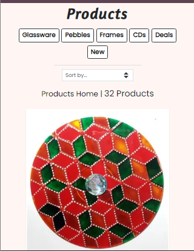
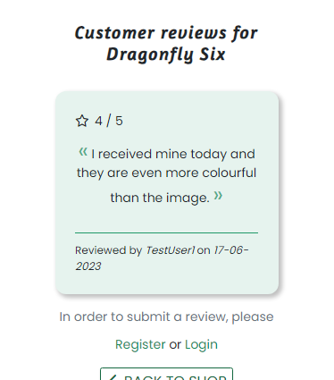

# VERA'S RECLAIMED TREASURES

Welcome to Vera's Reclaimed Treasures, a full stack e-commerce website built using the Django framework, Bootstrap, HTML, CSS, Python & JavaScript.  It utilises Stripe as the payment processor and Amazon Web Services S3 Bucket for storing static and media files. The project has been deployed on Heroku and uses a postgreSQL database instance hosted on ElephantSQL.

This project was created for educational purpose as my fifth and final project for a Diploma in Software Development with Code Institute.

Vera's Reclaimed Treasures is an online store where one can buy unique and sustainable products, hand-painted on upcycled materials in myriad patterns and colourful designs.

[Link to the live website](https://veras-reclaimed-treasures.herokuapp.com/).


_____

## Table of Contents

- [VERA'S RECLAIMED TREASURES](#veras-reclaimed-treasures)
  - [Table of Contents](#table-of-contents)
  - [Introduction](#introduction)
  - [Business Model](#business-model)
    - [Marketing Strategy](#marketing-strategy)
      - [Social Media Marketing](#social-media-marketing)
      - [Email Marketing](#email-marketing)
    - [Search Engine Optimisation](#search-engine-optimisation)
    - [Website Main Goals](#website-main-goals)
  - [User Experience](#user-experience)
    - [User Stories](#user-stories)
    - [Project and Database Structure](#project-and-database-structure)
      - [Data Models](#data-models)
    - [Wireframes and Design Choices](#wireframes-and-design-choices)
  - [Agile Methodology](#agile-methodology)
  - [Features](#features)
    - [Existing Features](#existing-features)
    - [Future Features](#future-features)
  - [Technologies Used](#technologies-used)
    - [Languages](#languages)
    - [Frameworks \& Dependencies](#frameworks--dependencies)
    - [Tools](#tools)
  - [Deployment](#deployment)
  - [Validation and Testing](#validation-and-testing)
  - [Bugs](#bugs)
  - [Credits](#credits)
    - [Code](#code)
    - [Media](#media)
    - [Acknowledgements](#acknowledgements)

[Back to Top](#table-of-contents)
_____

## Introduction

In my planning phase for this project, I wanted to create an e-commerce store for hand-made candles and soaps until I came across this lady's hand-painted collection of upcycled products at a fair in Malta. I was absolutely enthralled by what she had managed to create and decided to ask her for permission to use her creations as the basis of my e-commerce store.  That lady's name is Vera and her small business is called Vera's Magical Creations. At the moment, Vera reaches potential customers at local markets, through her [facebook page](https://www.facebook.com/profile.php?id=100070440427112), or by word of mouth. All transactions are cash-based and delivered in person, which is time-consuming.  

This project aims to create a more permanent online presence for Vera's business.  It gives her a way to organize her products, keep track of orders and automate sales without necessarily having to interact directly with all her customers.  An online store can help her reach a wider audience and maximize her business's potential.

By following the principles of User Experience Design, Search Engine Optimization and utilizing the Django full-stack framework and Stripe API for secure payments, Vera's Reclaimed Treasures offers its customers an efficient and seamless way to view and purchase her products from anywhere in the world.

You can test the payment functionality by using the following details in the checkout page:

-	Card Number: 4242 4242 4242 4242
-	Expiry Date: Any future date formatted to MM/YY
-	CVN: Any 3 digit number
-	Postcode: Any 5 digits

[Back to Top](#table-of-contents)

_____

## Business Model

Vera's Reclaimed Treasures is a Business to Consumer(B2C) e-commerce site.  It gives the site owner an online presence where people can find her latest works and browse a wide range of finished pieces.  In addition to being a store, it is also a showcase of Vera's artistic abilities.  It carries a message of eco-consciousness and will appeal to people who are seeking eco-friendly, creative art pieces.
As a small, fledgling business, Vera’s Reclaimed Treasures, relies on engaging with the customers, open communication and relationship building.  The website offers ways to get in touch with Vera with feedback, queries and suggestions. Customers can also post reviews on individual products which would help Vera improve the product selection while giving the customers a positive shopping experience.

The site's target audience falls into two overlapping tiers.  The first is people who are more broadly interested in art for use as décor or gifts.  The second are interested in reuse of discarded materials and items from an eco-friendly perspective.  These audiences are both very active demographics on Social Media, including Facebook, with many pages and discussion groups catering to them.

### Marketing Strategy

The marketing strategy at the outset will rely on a combination of organic content through social media,  and a newsletter subscription service.  Through creating attractive and engaging posts and emails, the aim will be to both foster and grow an audience for Vera's art while also directing traffic to the website.

#### Social Media Marketing

As mentioned above, Vera already has established a Business Facebook page and she has a few followerswho have purchased her products in the past and are interested in the same causes as her.  If utilized properly, this offers potential for business growth. 

Pros of a Business Facebook Page:

- Organic approach allows for limited growth at no cost.
- Potential customers can be attracted to the posts based on interests relevant to the business, specifically Art and Environmentalism.
- Fosters a sense of community through engagement, building brand personality.
- Helps improve customer service and support.
- The existing Facebook page already has an established presence and a foundation of showcasing many of her art pieces.
- The Facebook Business page will include the link to the online e-commerce store, while users of the site are also linked back to her Facebook page so that they are kept in the loop about any new pieces, posts etc.

Opportunities for improvement:

- Increase the variety and consistency of content and posts.  This can include images and videos of Vera working at her craft.  
- Useful posts like tips and tricks and how to reuse recycled materials.
- Have Q & A sessions: getting people to ask questions which she will answer in a video.
- Posts about upcoming promotions, sales & deals.
- Posts about upcoming in-person events, where Vera will be displaying and selling some of her work and asking people to bring recycled materials.

For the purposes of this project, a mock-up Business Facebook page was created, similar to Vera's own.
  


Links to the Social links can be found in the Footer of the website as well as on the Contact Page.


#### Email Marketing

A Newsletter subscription service will be set up on the e-commerce website.  This will keep users up to date on Vera's news, special promotions and more, while encouraging them to revisit the website.

Pros of posting a Newsletter:

- Easy and free to set up.
- Acts as a reminder to previous customers and others interested in Vera's products.
- Does not need to be as regular as Facebook posts.
- Different approaches can be tested out, allowing for a more refined marketing strategy over time.
- A way to inform potential and returning customers about seasonal products, discount codes and dates for bringing in recycled materials for upcycling.
  
A newsletter sign-up form has been added to the Footer of the website.


### Search Engine Optimisation

Search Engine Optimisation(SEO) is a set of practices designed to improve the appearance and positioning of web pages in organic search results. To improve my website's visibility on search engines, I started by conducting some keyword research and defining short-tail and long-tail keywords.  I used [Word Tracker](https://www.wordtracker.com/) to narrow them down to the most relevant.  Once I had identified the keywords, I used them in the website's meta tags, title, headings, content and image alt descriptions.  These will help search engines understand the relationship between the different pages on the website.

A [sitemap.xml](https://www.xml-sitemaps.com/) and a robots.txt file were also added to my project.  The sitemap lists all the pages on the website, while the robots.txt file tells search engines which pages they should not crawl.

In the footer I added one link to the Eco Market Malta website. This website ranks higher on Google and is very relevant to Vera's Reclaimed Treasures as it promotes artists and eco-friendly products.

A privacy policy was also added to the website. While this is not a direct ranking factor for SEO, it is recommended to have Google and other search engines index it. In addition, it helps improve the website's credibility and trustworthiness and compliance with various laws and regulations related to data protection and privacy.

### Website Main Goals

For the site owner:

- To be able to showcase her collection to a wider audience.
- To provide her customers with up-to-date information about her business and herself.
- To have an inventory of her products displayed in the one place.
- To have a safe and efficient way to get payment for her products.
- To keep track of the orders made by her customers.
- To have a limit on Made to Order purchases.
- To be able to easily mark products as not available.
- To be able to add new products to the inventory through the admin panel.
- To be able to quickly respond to customer queries.
- To be able to improve her product selection through customers’ orders and feedback.

For the user/customer:

- To give users a responsive and easy to navigate website with a clear purpose.
- To provide users with products that meet their expectations.
- To allow users to view details on products and add them to their shopping basket.
- To allow users to purchase products as Made to Order if the stock runs out.
- To allow users to checkout quickly and safely.
- To give users the option to save their information for future visits.
- To give registered users the ability to view their previous orders.
- To give registered users the ability to submit product reviews.
- To give users ways to contact the business owner easily and efficiently.

[Back to Top](#table-of-contents)
_____

## User Experience

This section aims to determine what a user would expect from interacting with the website. Each User Story was recorded in [GitHub Issues](https://github.com/MoniPar/reclaimed-treasures/issues).  Scenarios of actions each type of user, including the business/site owner, wishes to take are listed below.  These were categorised into Epics listed in the Agile Methodology section, for the development of the project.  Two of the user stories listed below were not completed on time and have been placed in the backlog for future iterations.

### User Stories

From User/Customer perspective:

- [#7](https://github.com/MoniPar/reclaimed-treasures/issues/7) As a user, I can register for an account, so that I have access to other features of the website.
- [#8](https://github.com/MoniPar/reclaimed-treasures/issues/8) As a user, I can check my emails for a registration confirmation email, so that I can verify that my registration was successful.
- [#9](https://github.com/MoniPar/reclaimed-treasures/issues/9) As a Registered User, I can login and logout from my account, so that I can access my account's information and keep my information secure.
- [#10](https://github.com/MoniPar/reclaimed-treasures/issues/10) As a Registered User, I can reset my password, so that I can recover access to my account if I forget my password.
  
- [#11](https://github.com/MoniPar/reclaimed-treasures/issues/11) As a User, I can land on the homepage of the site, so that I can learn more about the business and the types of products they sell.
- [#12](https://github.com/MoniPar/reclaimed-treasures/issues/12) As a User, I can view the logo and the links in the navigation bar, so that I can easily navigate to other pages of the site.
- [#13](https://github.com/MoniPar/reclaimed-treasures/issues/13) As a User, I can access contact details, social and developer links across all pages, so that I can follow/contact the business owner and the website creator.
- [#15](https://github.com/MoniPar/reclaimed-treasures/issues/15) As a User, I can learn more about the business, so that I can decide if I want to purchase from them or not.
- [#17](https://github.com/MoniPar/reclaimed-treasures/issues/17) As a User, I can quickly write a message to the business owner using the contact form, so that I can ask questions or give feedback.
- [#18](https://github.com/MoniPar/reclaimed-treasures/issues/18) As a User, I can sign up to the newsletter, so that I keep updated on the latest products, offers and pop up stalls.
- [#19](https://github.com/MoniPar/reclaimed-treasures/issues/19) As a User, I can connect with my social media account, so that I can easily create an account. - Not Completed

- [#24](https://github.com/MoniPar/reclaimed-treasures/issues/24) As a User, I can view a list of products, so that I can select some to purchase.
- [#25](https://github.com/MoniPar/reclaimed-treasures/issues/25) As a User, I can view individual product details, so that I can identify more information about the product.
- [#26](https://github.com/MoniPar/reclaimed-treasures/issues/26) As a User, I can search for a specific product or view a category of products, so that I can quickly find products I'm interested in.
- [#27](https://github.com/MoniPar/reclaimed-treasures/issues/27) As a User, I can sort the list of available products, so that I can easily identify the best rated and best priced categorically sorted products.

- [#29](https://github.com/MoniPar/reclaimed-treasures/issues/29) As a customer, I can access my basket, so that I can review items before I purchase them.
- [#31](https://github.com/MoniPar/reclaimed-treasures/issues/31) As a customer, I can add items and identify their total cost in the basket, so that I know how much I'm spending.
- [#33](https://github.com/MoniPar/reclaimed-treasures/issues/33) As a Customer, I can update the quantity of each item in my basket, so that I can easily make changes to my order before checkout.
- [#34](https://github.com/MoniPar/reclaimed-treasures/issues/34) As a User, I can see real-time notifications as I interact with the website, so that I can have a better experience.

- [#36](https://github.com/MoniPar/reclaimed-treasures/issues/36) As a Customer, I can confirm my items and total cost in the checkout page, so that I can continue to enter the required information to complete my order.
- [#38](https://github.com/MoniPar/reclaimed-treasures/issues/38) As a Customer, I can easily enter my payment information, so that I can checkout quickly and efficiently.
- [#39](https://github.com/MoniPar/reclaimed-treasures/issues/39) As a Customer, I can view an order confirmation after checkout, so that I can confirm that my order was successful.
  
- [#42](https://github.com/MoniPar/reclaimed-treasures/issues/42) As a Registered Customer, I can have a personal user profile, so that I can save my payment info and view my order history and confirmations.
- [#43](https://github.com/MoniPar/reclaimed-treasures/issues/43) As a Registered Customer, I can edit personal information on my profile, so that I can use the correct details when processing future orders.
- [#44](https://github.com/MoniPar/reclaimed-treasures/issues/44) As a Customer, I can receive an email confirmation after checking out, so that I can keep the confirmation of the transaction for my records.

- [#46](https://github.com/MoniPar/reclaimed-treasures/issues/46) As a User, I can check products' ratings and reviews, so that I can make up my mind if I want to purchase the product.
- [#46](https://github.com/MoniPar/reclaimed-treasures/issues/46) As a Registered User, I can add a review, so that I can submit my feedback on the product.
- [#48](https://github.com/MoniPar/reclaimed-treasures/issues/48) As a Registered Customer, I can edit and delete my reviews, so that I have the ability to correct any mistakes I make.

- [#47](https://github.com/MoniPar/reclaimed-treasures/issues/47) As a User, I can navigate to the About page, so that I can learn more about the shop owner.
- [#52](https://github.com/MoniPar/reclaimed-treasures/issues/52) As a User, I can easily navigate back to the top of the page with one click, so that I can easily access other parts of the website. - Won't Have

The following User Stories were used to implement features which make the website run more smoothly and give the user a better experience using the website.  Some are made from the Business owner's or Developer's perspective.  Stories concerned with setting up and other developer tasks were left out from this list. Due to time lost with Code Anywhere technical issues, it was decided to leave the Product Management Interface and the Featured Products on Home page out. These were placed in the backlog for future iterations.

- [#14](https://github.com/MoniPar/reclaimed-treasures/issues/14) As a business owner, I can have a banner with a CTA clearly visible on the landing page, so that users are encouraged to access the shop and view/buy products.
- [#16](https://github.com/MoniPar/reclaimed-treasures/issues/16) As a business owner, I can choose which products to feature on the landing page, so that users are encouraged to check them out. - Backlog
- [#20](https://github.com/MoniPar/reclaimed-treasures/issues/20) As a Shop Owner, I can use the Admin interface to add, update, view and delete products so that I can populate the online shop.
- [#21](https://github.com/MoniPar/reclaimed-treasures/issues/21) As a store owner, I can add a product via the UI, so that I can add new items to my store. - Backlog
- [#22](https://github.com/MoniPar/reclaimed-treasures/issues/22) As a store owner, I can edit/update a product via the UI, so that I can change the product price, description, image and other product criteria. - Backlog
- [#23](https://github.com/MoniPar/reclaimed-treasures/issues/23) As a store owner, I can delete a product via the UI, so that remove items that are no longer on sale. - Backlog
  
- [#32](https://github.com/MoniPar/reclaimed-treasures/issues/32) As a developer, I can add functionality with the plus (+) and minus (-) buttons to the quantity selector, so that the user has a better experience adding products to their basket on mobile.
- [#40](https://github.com/MoniPar/reclaimed-treasures/issues/40) As a developer, I can make sure that customers can confidently provide the information required safely and securely, so that they can have a positive experience on the site.

- [#41](https://github.com/MoniPar/reclaimed-treasures/issues/41) As a developer, I can decrement stock on payment success, so that I can add functionality when item becomes out of stock.
- [#50](https://github.com/MoniPar/reclaimed-treasures/issues/50) As a Business Owner, I can have my Business Facebook page linked with my website, so that I can connect and interact with my customers directly and potentially extend my reach through posts and other content creation.
- [#51](https://github.com/MoniPar/reclaimed-treasures/issues/51) As a Developer, I can add metadata, a sitemap and robots.txt file, so that the website can be found and ranked by search engines.
- [#55](https://github.com/MoniPar/reclaimed-treasures/issues/55) As a Developer, I can build custom error pages, so that the user remains on the site and has a way to get back to the homepage or access navigation.

[Back to Top](#table-of-contents)

_____

### Project and Database Structure

Utilising the Django Framework, the project is divided into specific apps handling the different features of the website. The Project directory contains the different folders for these apps as well as a templates folder where the Allauth Authentication folders, the base templates and error pages templates live. It also contains a media folder for the product images and all other images on the website and a static directory which serves as a central location for storing static assets used throughout the project in development.

The base template holds all the necessary <head> elements including the meta tags, title, links to stylesheets and scripts etc.  It also holds the Navigation, Footer and Messages/Toasts Code. All other apps' templates are extended from the base template.

The Main Project app holds the project's configuration file (settings.py) as well as the main URLs and the views for the error pages.  Each of the apps described below also contains its own views and URLs files.

The Home App includes the content of the Home Page as well as that of the About Page.  Like most of the other apps mentioned below it also contains its own static folder and stylesheet specific to the app's added styles.

The Products App includes the Shop Page and Product Detail functionality.  This is mostly based on the Boutique Ado walkthrough, with added features such as product stock & product availability.  The increment button on the product detail page has been amended to increment item quantity only up to 10 on products in stock, as Vera's inventory is quite small.   On Made to Order products, the increment button only goes up to 3.  This is to make sure that Vera doesn't get a large order of products that are not ready to be shipped.  The product availability was also added so that Vera can decide if she wants to replenish her stock before setting the product up as Made to Order, as some of her products take time to prepare and others depend on the availability of recycled materials.

The Review App includes a custom model for Reviews.  This gives registered users C.R.U.D. functionality to add, update and delete their reviews.  It was decided to have it set so that only one review on each product is submitted by the user.  At the moment, any registered user can submit a review on products, even if they have not purchased them yet.  This was done on purpose, in order for Vera to gauge user interest on specific products in her collection.  In the future, it would be best to have a check before the review is published to make sure that this feature is not misused.  

The Basket App includes the functionality for the basket.  Once again, this is based on the Boutique Ado project with the added functionality on the increment button mentioned in the Product App paragraph above.  Users can update the quantity of items in their basket or delete them if they change their mind.  They can also see a subtotal and a total for their order on the page and under the basket icon in the navigation.

The Checkout App includes the functionality to handle the payment form.  Before the user gets to the checkout form page, I added a final check on the quantity of each product in their basket to make sure that there isn't an overflow greater than the limit of 3 items on products that were not marked as Made to Order.  Again, this is to ensure that Vera doesn't get a large order of products that are not readily available for shipping.  Upon form validation and successful payment intent, the user is directed to the checkout success page where they can see details of their order.  This is when the product stock is decremented in the database and the products are set to Made to Order if the stock is 0.

The Contact App handles the Contact form functionality, where users can easily submit their queries or suggestions.  This is set so that Vera receives an email directly to her business email account in order to facilitate fast action.  Once the form is submitted, the user is directed to a thank you page.

#### Data Models

Models define the source of the data stored.  Each model contains the essential fields and behaviours of the data being stored. The image below shows this project's Data Schema and the relationships between the models.

<details>
<summary>Database Schema</summary>
<br>


</details>

The shaded tables are the custom models created for this project. These include the Review Model stored in the Review App and the Contact Model stored in the Contact App as mentioned above. The Product Model was customised to include extra features (please read on for more information).  

The Review Model has a one-to-many relationship with the Product Model and a Many-to-One relationship with User.  It stores the rating for each product, the comments and submission dates of reviews made by registered users.  This gives registered users C.R.U.D. functionality to add, update and delete their reviews.  It was decided to have it set so that only one review on each product is submitted by the user.  At the moment, any registered user can submit a review on products even if they have not purchased them yet.  This was done on purpose, in order for Vera to gauge user interest on specific products in her collection.  In the future, it would be best to have a check before the review is published to make sure that this feature is not misused.

The Contact Model has changed a little since the design of the Database Schema.  Extra fields were added to provide more information.  Having the subject field as a choice field, helps Vera quickly assess which submissions require more urgent action.  The date of submission and the actioned fields were also added to this effect.
  
The Product Model was customised to include:

- A field for additional information, this includes the weight and size of the product as well as the care information for certain products.  
- A theme field, added to be able to categorise the products by the type of designs they display.  This would be helpful for commissions users might request.  
- A stock field, which adds functionality to this model.  This is set to display the number of items left in the inventory.  Once the number of items in the inventory is decremented to 0, the Made to Order text is displayed and the customer is only allowed to order a limited quantity of that particular product per order.  
- An available field displays a checkbox in the admin, which if unchecked would display a disabled button on the product detail page instead of the increment and decrement buttons.  This would stop the user from being able to purchase the product, giving Vera time to replenish her stock and/or source the recycled materials needed.  
- Finally, an image thumbnail field was added in order to be able to add smaller versions of the product images to help the shop page load faster.

### Wireframes and Design Choices

[Balsamiq](https://balsamiq.com/wireframes) was used to sketch wireframes for the most essential parts of the website, getting a feel for the website as a whole and an indication of the finished design. Through the implementation phase a few elements were changed to allow for a better user experience.

[Ctrl + click for mobile wireframes pdf](docs/vrt-wireframes-mobiletablet.pdf)

[Ctrl + click for desktop wireframes pdf](docs/vrt-wireframes-tabletdesktop.pdf)

**Colour Scheme**

[Coolors]( https://coolors.co/) was used to generate a colour palette for the website.  Since Vera's Reclaimed Treasures is an eco-friendly business, it was decided to use emerald green for the logo and the buttons.  The rest of the colours were created from the Home Page Hero image using Coolors Image picker.  


Giants orange created a strong contrast against the dark overlay on the background images.
Eggplant was used for the delivery banner to create more contrast against the white navigation.
Mulberry colour was used as a hover effect on the main navigation links.  A very low opacity of this colour was also used as a background colour through out all the site.

**Typography**

[Google Fonts]( https://fonts.google.com/) Amaranth was used as the heading's font for the website. This font has some distinctive curves which makes it ideal for headings while still easy to read.  Poppins, a geometric sans-serif font was used as the main font of the website.  Roboto mono was used in the order summary to mimic a printed receipt.

**Icons**

[Font Awesome](https://fontawesome.com) icons are used throughout the site.  The Social Media icons on the Footer and the Contact page are interactive links and have an aria-label which gives the relevant information to screen readers.   The icons on the product cards also have an aria-label as well as a tooltip explaining what the icon is meant to convey.  Other icons on the site are used for decorative purposes only and are set not to be read by screen readers.

[Back to Top](#table-of-contents)
_____

## Agile Methodology

Agile Methodology was used during the development of this project.  This was my second time using this methodology and I took a slightly different approach to it.  During the planning of the project, the main user stories were recorded in a document.  The relevant user stories were then added in [GitHub Issues](https://github.com/MoniPar/reclaimed-treasures/issues) at each phase of development. They were labelled with User Story Points and MoSCoW prioritisation and assigned to an Epic/Milestone.  At the start of development, I used individual Epics/Milestones as my Sprints. Some User Stories were started but could not be completed within the Sprint Cycle they were assigned to, so they were placed in the backlog to be tackled again at a later stage.  As the project progressed further and more User Stories were created, my Sprints became a mixture of User Stories from different Epics/Milestones.

**Epics/Milestones**

In total 10 Epics were created during the development of this project. These were recorded in [GitHub Project Milestones](https://github.com/MoniPar/reclaimed-treasures/milestones). In hindsight, the Epics 'Product Management' and 'Product Viewing & Navigation' should have been amalgamated into one.  'Product Management' mostly had stories that were not necessary for the MVP of this project and did not get to be implemented before submission.

**Sprints**

This project was completed in 9 sprints.  The first 3 sprints were completed in the first week while each of the other sprints took about a week to complete.  

<details>
<summary>First Sprint Screenshot</summary>
<br>


</details>

The first sprint tackled the Initial Setup Epic and involved getting the development environment set up and the relevant packages installed. I decided to get the project ready for deployment at this early stage, so Heroku and the production database were configured and set up during this sprint.  Since this was done relatively fast, I also used the time to start setting up the S3 bucket.  The AWS Bucket Setup story was then placed in the backlog to be completed at a later stage.

Completed User Stories:

- [#1 Installation](https://github.com/MoniPar/reclaimed-treasures/issues/1)
- [#2 Create the Django project and first app](https://github.com/MoniPar/reclaimed-treasures/issues/2)
- [#3 Create the Heroku app and external PostgreSQL database](https://github.com/MoniPar/reclaimed-treasures/issues/3)
- [#5 Preparation and first deployment](https://github.com/MoniPar/reclaimed-treasures/issues/5)
- [#6 Admin Panel Access](https://github.com/MoniPar/reclaimed-treasures/issues/6)

<details>
<summary>Second Sprint screenshot</summary>
<br>


</details>

The second sprint tackled the User Registration & Authentication Epic and  involved setting up Django Allauth functionality. While shorter than the first sprint, this took a bit longer than expected as I ran into some issues while copying the templates.  The Password Reset story was placed into the backlog as one of the tasks needed testing in production.

Completed User Stories:

- [#7 Registration](https://github.com/MoniPar/reclaimed-treasures/issues/7)
- [#8 Registration Confirmation Email](https://github.com/MoniPar/reclaimed-treasures/issues/8)
- [#9 Login & Logout](https://github.com/MoniPar/reclaimed-treasures/issues/9)

<details>
<summary>Third Sprint screenshots</summary>
<br>


</details>

The third sprint tackled the Landing Page and Navigation Epic and involved creating the skeleton structure for the front-end and implementing the main navigation functionality. The Newsletter story in the image above is marked as a Must.  This was a mistake on my part as my plan was to have it in the footer which should have been marked as Must instead. The Newsletter story was not tackled in this sprint.

Completed User Stories:

- [#11 Home Page](https://github.com/MoniPar/reclaimed-treasures/issues/11)
- [#12 Navigation](https://github.com/MoniPar/reclaimed-treasures/issues/12)
- [#13 Footer](https://github.com/MoniPar/reclaimed-treasures/issues/13)
- [#14 Call to Action](https://github.com/MoniPar/reclaimed-treasures/issues/14)

<details>
<summary>Fourth Sprint screenshot</summary>
<br>


</details>

The Fourth sprint tackled one user story from the Product Management Epic and the Product Viewing and Navigation Epic, and consisted of setting up and getting the online shop running.  This was a much longer sprint than the others before it, but I got it completed within the intended timeframe.

Completed User Stories:

- [#20 Setting up the online shop](https://github.com/MoniPar/reclaimed-treasures/issues/20)
- [#24 View Products](https://github.com/MoniPar/reclaimed-treasures/issues/24)
- [#25 View Product Detail](https://github.com/MoniPar/reclaimed-treasures/issues/25)
- [#26 Search and Filter Products](https://github.com/MoniPar/reclaimed-treasures/issues/26)
- [#27 Sort Products](https://github.com/MoniPar/reclaimed-treasures/issues/27)

<details>
<summary>Fifth Sprint screenshot</summary>
<br>


</details>

The Fifth sprint tackled the Shopping Basket Epic and involved creating the shopping basket functionality including toast messages.  Again this was a longer sprint, but the number of story points within seemed optimal.

Completed User Stories:

- [#29 Basket Access](https://github.com/MoniPar/reclaimed-treasures/issues/29)
- [#30 Context Processor](https://github.com/MoniPar/reclaimed-treasures/issues/30)
- [#31 Add items & total cost](https://github.com/MoniPar/reclaimed-treasures/issues/31)
- [#32 Quantity Selector](https://github.com/MoniPar/reclaimed-treasures/issues/32)
- [#33 Updating and Removing Items](https://github.com/MoniPar/reclaimed-treasures/issues/33)
- [#34 Toasts](https://github.com/MoniPar/reclaimed-treasures/issues/34)

<details>
<summary>Sixth Sprint screenshot</summary>
<br>


</details>

The Sixth sprint tackled the Checkout Epic and involved creating the functionality for the checkout including the implementation of secure payments via the Stipe API.

Completed User Stories:

- [#35 Checkout App](https://github.com/MoniPar/reclaimed-treasures/issues/35)
- [#36 Checkout Page](https://github.com/MoniPar/reclaimed-treasures/issues/36)
- [#37 Setup Stripe Card Element](https://github.com/MoniPar/reclaimed-treasures/issues/37)
- [#38 Payment System Basic Functionality](https://github.com/MoniPar/reclaimed-treasures/issues/38)
- [#39 Checkout Success Logic](https://github.com/MoniPar/reclaimed-treasures/issues/39)
- [#40 Stripe Webhooks](https://github.com/MoniPar/reclaimed-treasures/issues/40)

<details>
<summary>Seventh Sprint screenshot</summary>
<br>


</details>

The Seventh sprint continued tackling the Checkout Epic and the User Profile Epic.  In this sprint I started adding the functionality for decrementing the product stock from the inventory on which I spent the majority of the time.  While working on that user story, I quickly came to realise that it needed a lot more work than I had anticipated.  In hindsight, I should have divided it into a few more user stories, which would have included updating the functionality of the increment button on the product detail page and the basket page.  The story points for the Product Stock user story were not indicative of the work required for it.

Completed User Stories:

- [#41 Product Stock](https://github.com/MoniPar/reclaimed-treasures/issues/41)
- [#42 User Profile](https://github.com/MoniPar/reclaimed-treasures/issues/42)
- [#43 Update User Profile](https://github.com/MoniPar/reclaimed-treasures/issues/43)
- [#44 Email Confirmation](https://github.com/MoniPar/reclaimed-treasures/issues/44)

<details>
<summary>Eighth Sprint Screenshots</summary>
<br>


<br>


</details>

The Eight sprint was originally set to tackle the 4 user stories from different Epics (displayed in the image above) as well as a bug I found while testing the product stock functionality.  Another user story was created for the product review functionality which was added to this sprint as displayed in the second image above.

With this sprint completed, the project was deployed again, this time with the media files in the S3 bucket.

Completed User Stories:

- [#17 Contact Form](https://github.com/MoniPar/reclaimed-treasures/issues/17)
- [#18 Newsletter](https://github.com/MoniPar/reclaimed-treasures/issues/18)
- [#46 Product Review](https://github.com/MoniPar/reclaimed-treasures/issues/46)
- [#48 Product Review – Edit & Delete](https://github.com/MoniPar/reclaimed-treasures/issues/48)
- [#47 About Page](https://github.com/MoniPar/reclaimed-treasures/issues/47)
- [#4 AWS Bucket Setup](https://github.com/MoniPar/reclaimed-treasures/issues/4)

<details>
<summary>Ninth Sprint screenshot</summary>
<br>


</details>

The Ninth sprint mainly tackled the SEO and Web Marketing Epic and included some bugs I found while testing the deployed site. The Back to Top button user story was deemed unnecessary since the navigation was always fixed at the top, so it was marked as a won't have.

Completed User Stories:

- [#51 SEO Implementations](https://github.com/MoniPar/reclaimed-treasures/issues/51)
- [#50 Social Media Marketing](https://github.com/MoniPar/reclaimed-treasures/issues/50)
- [#10 Password Reset](https://github.com/MoniPar/reclaimed-treasures/issues/10)

**Final Thoughts on Agile**

Although there is still a lot of room for improvement when it comes to adopting this methodology to its full extent, I still feel that it helped a lot in keeping me focussed on the priorities of the MVP project.  Even though I didn't set any due dates for my sprints, I found that it helped me get into a good rhythm of planning -> coding -> testing -> planning cycle.

[Back to Top](#table-of-contents)
_____

## Features

### Existing Features

**HEADER & NAVIGATION**

Featured on all pages, the fully responsive header is fixed to the top so that the user always has access to the navigation links, and is divided into 3 parts:

1. The Top Navigation - consisting of:

    - The website's logo, which is a link that brings the user to the Home Page.
    - A search box on desktop or search icon on mobile and tablet, which when clicked, opens a text input for users to search the Shop Owner's Collection.
    - An icon for Accounts, which when clicked, drops down links for the Registration & Login Pages for users who are not logged in, or My Profile & Logout Pages for users who are logged in.
    - An icon for the shopping basket which displays the grand total on desktop. On mobile and tablet this icon shows the grand total when clicked.
    - All links have a hover and focus effect to help the user identify them as links.

2. The Main Navigation - consisting of:

    - Links to the Home, Shop, About and Contact Pages.
    - The Shop link is a dropdown element which opens up to display links to the different types of products in the shop. The last link in this dropdown brings the user to the Shop Page with all products.
    - On mobile and tablet, the main navigation links are accessed by toggling the hamburger button.
    - All links have a hover and focus effect to help the user identify them as links.

3. The Delivery Banner with its dark background to highlight the text displayed within.

<details>
<summary>Click to view screenshots</summary>
<br>

    Mobile Navigation


<br>

    Mobile Navigation Open


<br>

    Mobile Navigation Search


<br>

    Tablet Navigation Account Dropdown


<br>

    Desktop Navigation 


<br>
</details>

**FOOTER**

Featured on all pages, the responsive footer is valuable to the users as it encourages them to get in touch via phone or email, if they prefer that method of contact. It also allows the users to keep connected via social media and to sign up for the newsletter.  It includes:

- A newsletter signup – This is valuable to the user as it keeps them up to date with offers, new products, seasonal deals and news from the Shop Owner.
- The website logo, which is in itself a link directing the user back to the Home Page.
- Contact details are links which direct the user to the relevant apps. On mobile, the telephone number will bring up a call feature, while the email address will open up an email app on tablet and desktop as well.
- Social links open in a new tab so that users are not directed away from the website.
- Useful links are links that direct the user to:
  - the Privacy Policy of the Ecommerce Store (opens in a new tab),
  - the Contact Page of the website in order for the user to submit a query and
  - Eco Market Malta - a website which advocates for sustainability and includes relevant information to this e-commerce site.
- Copyright has a link to the creator's LinkedIn page, which also opens in a new tab.
- All links have a hover and focus effect to help users identify them as links.
- All links are labelled for screen reading technology.

<details>
<summary>Click to view screenshots</summary>
<br>

    Lower Footer on Mobile


<br>

    Footer on Tablet


<br>

    Footer on Desktop


<br>
</details>

**LANDING PAGE**

**Home Page Hero**

The Home page hero on the Landing Page takes up more than half the viewport of any screen size.  It includes a background image of a few chosen products from the online store with an overlay of a heading and sub heading which capture the essence of the store.  It also acts as a Call to Action(CTA) as it includes a bright button inviting the user to shop now.  The button has a hover and focus effect as demonstrated below.

<details>
<summary>Click to view screenshots</summary>
<br>

	Home Hero on Tablet 


<br>

	Home Hero on Desktop with hover


<br>
</details>

**Home Page Content**

The Home Page displays further content which gives the user an outline of what the business is about.  It includes three cards, each displaying an icon, a heading and some text giving more detail about the business.  Each card also has a button which directs the user to more information throughout the site’s pages. All three buttons have a hover and focus effect to show the user that they are interactive elements.

<details>
<summary>Click to view screenshots</summary>
<br>

	Home Content on Mobile

	

<br>

	Home Content on Tablet


<br>

	Home Content on Desktop


<br>
</details>

**SHOP**

**All Products**

The Shop Page, reached through the All Products link in the Shop dropdown on the Main Navigation, displays all the products available in the store with category badges to facilitate access to the different categories of products.  The badges are links and have a hover and focus effect to show that they are interactive elements.  Another link to the Products Home is available at the top of this page to bring the user back to All Products if they have been browsing by category.  

The Shop Page, reached through the Shop Now button on the Home Page, displays all the products available in the store without the category badges.As above, it also displays the number of products on the current page. This number changes depending on which category of products the user chooses. A sort-selector box is also available, which helps the user sort the products by price, name, rating, theme, category, and availability.

Each product card displays the product image, name, price, category, theme, rating and a link to view more details.

<details>
<summary>Click to view screenshots</summary>
<br>

	Mobile View



<br>

	Tablet View


<br>

	Desktop View


<br>

	Product Card


<br>
</details>

**PRODUCT DETAIL**

The Product Detail Page displays more information about each specific product in the shop.  The Page is divided into two sections, with the top section showing information on the product and the bottom section showing any available reviews on the product.

Product Detail section features:

-	Product name as a heading
-	Product image which is a link that opens the image file in a new tab
-	Product price high-lighted for better visibility
-	Product SKU for reference
-	Product category which links to other products in same category
-	Product theme
-	Product rating (this could be No rating if product hasn’t yet been reviewed)
-	Product description which describes the product
-	Product stock.  If the stock is 0, this changes to Made to Order and a short highlighted note is displayed to notify users of order quantity limitations and possible delays in delivery times
-	Product additional information, which is a dropdown link, giving extra information on weight, dimensions and care details
-	Quantity selector buttons which increment or decrement the quantity as needed by the user
-	Add to Basket button which adds the quantity selected to the user’s basket
-	Back to Shop button which brings the user back to the main products page

<details>
<summary>Click to view screenshots</summary>
<br>

	Product Detail In Stock on Mobile


<br>

	Product Detail Made to Order on Tablet & Desktop


<br>
</details>

**PRODUCT REVIEWS**

This section varies depending on whether there are any reviews submitted on the product and whether the user is a registered user or not.

All users can view the reviews if they are available.  If no reviews are available, text will say “There are currently no reviews on this product”.  

If user is not logged in, text at the bottom invites them to register or login to submit a review.

Only registered users are allowed to add reviews. The Add review button is available to registered users who have not yet submitted a review on the product.  If a registered user has already submitted a review, then they are only allowed to edit or delete the review.  Buttons are displayed accordingly.

<details>
<summary>Click to view screenshots</summary>
<br>

	No Reviews Unregistered User on Mobile View


<br>

	Reviews Unregistered User on Mobile View



<br>

	 Registered User Reviewed on Tablet View


<br>

	Registered User Not Reviewed on Desktop View


<br>
</details>

**Add Review Page**

The Add Review Page displays an image of the product being reviewed, the category and the name of the product.  This acts as a reminder for the user when reviewing the product.  The form is very simple, which makes the process easy and quick for the logged-in reviewer.  All they need to do is pick a rating from 1 to 5 and write a short comment in the comment field, then click the Add button.  Both fields are required, and the user can click the Cancel button to get back to the Product Detail Page, where they can check out more information about the product or see what other people have said in their reviews. Once the review is submitted, the user is directed back to the product detail page where they get a success toast.  They can then see their review immediately on the page and the average rating of all reviews on the product detail.

<details>
<summary>Click to view screenshots</summary>
<br>

	Product with No Rating


<br>

	Add Review Page on Tablet


<br>

	Fill in Form


<br>

	Toast Success & Product Rating


<br>

Post Add Review View


<br>

</details>

**Edit Review Page**

The Edit Review Page is very similar to the Add Review Page.  The only difference is that the form displays pre-populated with the review information.  A logged in user can choose to change the rating, the comment or both on their own product reviews.  They can use the cancel button to get back to the Product Detail Page or update the review by clicking the Update button.  This will once again redirect them to the Product Detail Page where they can see their updated rating and review.

<details>
<summary>Click to view screenshots</summary>
<br>

	Edit Review Form Prepopulated


<br>

	Toast Success Update Review

 

<br>
</details>

**Delete Review**

A logged-in user can choose to delete their own product review by clicking on the Delete button on their review.  This will bring the reviewer to a confirmation page where they can either cancel out of deleting the review and be redirected back to the Product Detail page or Delete the review.

<details>
<summary>Click to view screenshots</summary>
<br>

	Delete Review Confirmation Page


<br>
</details>

**BASKET**

The Basket Page provides the user with a summary of the items they have added to their basket.  It also provides a subtotal for each product and a grand total for all the items in their basket.  Here, the user is provided with another opportunity to update the quantity of the products or remove them entirely.  Toasts will appear just below the navigation bar with confirmations of added, updated and deleted items as well as a small summary of what is in the basket. Error toasts notify users to amend their quantity if they update their quantity beyond the 10 items per product limit and 3 items per Made to Order product limit.  

The user can return back to the Shop to add more products via the Keep Shopping button or head over to checkout via the Secure Checkout button.

Final validation checks take place when the user clicks the Secure Checkout button to make sure the quantities ordered are within limits.  This is for quantities that are greater than the product stock + 3.

<details>
<summary>Click to view screenshots</summary>
<br>

	Basket Page on Mobile


<br>

	Updating Quantity Toast on Tablet


<br>

	Deleting Product Toast on Desktop


<br>

	Error Alert on updating quantity to more than 3 on Made to Order product


<br>

	Error Alert on updating quantity beyond the 10 per product limit


<br>

	Error Alert on Secure Checkout with quantity greater than product stock + 3


<br>
</details>

**CHECKOUT**

The Checkout Page consists of a summary of the basket items with subtotals and total including delivery, as well as a form for the user's delivery and billing information.  It aims to provide an easy and efficient way for a user to make a purchase.
  
Registered users can check the save info checkbox to save their information for faster checkout on future orders.  If they have already updated the info on their Profile Page, the checkout form would be pre-populated with their information.  Users who are not registered or logged in are given the option to do so, to save their information for future purchases.

The last field in the form is an input for the payment information.  Payments are processed by Stripe and to facilitate a payment, a user needs to input their card details into this field. If the details are invalid, a warning message is displayed below the payment field.

When the user lands on the Checkout Page, a webhook is created with the user's order and information details if available.  This is sent to Stripe which creates a payment intent for the order.  This is beneficial for the user in case they lose connection, or something goes wrong while processing the order.  This makes sure that their order is recorded and sent to the database for further processing.

Users have access to their basket via the Adjust Basket button in case they decide to update the items they want to order. A message at the bottom reminds the user of the Grand total amount that their card will be charged. They can complete the order by clicking on the Complete Order button.  Users are notified if the required fields are not filled in when they click the Complete Order button.

<details>
<summary>Click to view screenshots</summary>
<br>


<br>
</details>

**Checkout Payment Overlay**

When a user clicks the Complete Order button, an overlay with a spinner is displayed, giving the user some visual feedback that their order is being processed.  If there is any problem with the payment information, the user will be directed back to the Checkout Page and the payment field will be highlighted with an informative message.

At this stage, Stripe confirms that charge and sends a signal back to the database that the payment intent has succeeded.  The order is created and recorded in the database and the items ordered are deducted from the inventory.

**Checkout Success**

Once the order has been processed, a checkout success page is displayed with information about the order made.  A success toast is also triggered and the user receives a confirmation email for the order submitted.

A button at the bottom of the page directs the user to view the latest deals in the Shop.

<details>
<summary>Screenshot of Checkout Success Page & Email</summary>
<br>

	Checkout Success Page with Order Information


<br>

    Order Confirmation Email


<br>
</details>

**STOCK MANAGEMENT**

A basic stock management system has been implemented in this ecommerce project to facilitate Made to Order product functionality.  Each product has a limited number of stock available in the inventory, which is deducted after each order completion.  When the stock is down to 0, the product is marked as Made to Order on the UI.  This allows the customer to still be able to purchase the product, however the quantity is limited to only 3.  This makes sure that the shop owner doesn't get a high quantity of orders on products that are not yet ready to be shipped.

To limit the quantity of orders for a small inventory, the quantity selector (+) button is disabled when the quantity reaches 10 on products in stock and when the quantity reaches 3 on Made to Order products.  Further validation has been implemented in case the user manually types in a quantity using the quantity input box on both the Product detail page and the Basket page.

Tests and more information related to this feature can be found in [TESTING.md](TESTING.md) under User Stories go to Checkout User Story #39 and under Features Testing go to Product Detail & Basket.

**PROFILE**

The Profile Page is accessed by registered users only.  It consists of a form by which the user can update their delivery information, and a section where they can view their order history.

The logged-in user can access the Profile Page through the My Account icon in the navbar.  Here they can add their default delivery information which will then pre-populate the checkout form to speed up the checkout process.

The Order History section displays a table with the user’s previous orders, listing the order number, the date, the items purchased and the order total. The user can click on the order number to see more detail about the order.  This will direct them to the specific order history page and an alert toast is displayed informing the user that they are looking at a previous order. They can then go back to the Profile page by clicking on the Back to Profile button at the bottom of the page.

<details>
<summary>Click to view screenshots</summary>
<br>

	Profile Page


<br>

	Success Toast Updated Profile


<br>

	Order History with Alert Toast


<br>   
</details>

**REGISTRATION & AUTHENTICATION**

**Register Page**

The website has the functionality for a user to register an account to be able to log in and save their delivery information, view their order history and submit reviews.

The Registration Page can be accessed via the My Account icon on the Top Navigation Bar.  A non-logged in user can also access the registration page from the Reviews section on the Product detail pages and the Checkout form.

On the Registration Page there is a link and a button which directs the user to the Login Page, in case they already have an account.  Another button at the bottom can be used to go back to the Home Page.

To register for an account, the user is asked to enter both the email address and password twice to prevent any input errors.  They are also asked for a username. Once the user is satisfied with their form, they can click on the Register button which will bring them to the Confirm Email Page which will ask them to verify their email address.  An alert toast here displays the email address that the user has provided upon registration.  The user will then navigate to their email and click the link in the email sent by the site.  This will bring them to another page where they are asked to confirm their email address and username.  They will then be directed to the Login Page where a success toast tells them that they have confirmed the email address.  They can then login to their newly registered account.

<details>
<summary>Click to view screenshots</summary>
<br>

	Registration Form


<br>

	Confirm Email Page with Alert Toast


<br>

	Email with Confirmation Link


<br>

	Confirmation Link


<br>

	Login Form with Success Toast


<br>
</details>

**Login Page**

The Login Page can be accessed by a registered user straight after registration or via the My Account icon in the Top Navigation bar.  A non-logged in user can also access the Login Page via the Review section on the Product detail pages and the Checkout form.  

The Login Page features:

-	a link to the Registration Page, for users who haven't yet registered an account,
-	a form with inputs for username or email and password,
-	a Remember Me checkbox which gives the user the option to save their login details,
-	the Login button which will log them into their account,
-	a Forgot Password link which they can use to create a new password in case they have forgotten it and
-	a Home button which will bring the user back to the Home Page.
Both text input fields in this form are required and once the user submits the correct information they are directed to the Home Page as logged in users.

<details>
<summary>Click to view screenshots</summary>
<br>

	Login Page on Tablet


<br>

	Login Page Invalid Form


<br>

	Login Success


<br>
</details>

**Logout Page**

The Logout Page link is accessed via the My Account icon dropdown on the Top Navigation bar.  When a user selects this link, they are directed to a Logout Confirmation Page where they are asked to confirm if they want to log out.  The user is also given the option to cancel logging out using the Cancel button which will direct them to the Home Page while still logged in to their account.  If the user selects to log out, they are also redirected to the Home Page but this time they see a success toast alerting them that they have successfully logged out.  

<details>
<summary>Click to view screenshots</summary>
<br>

	Logout Confirmation Page


<br>

	Logout Success Toast


<br>
</details>

**Password Reset**

The Registration & Authentication functionality of django-allauth, gives the user the ability to reset their password if they have forgotten it.  The link for Forgotten Password? can be accessed through the Login Page.  When selected, the user is directed to the Password Reset Page where they are asked to enter their email address. After clicking on the Reset my Password button, they are directed to another page which instructs them to check their email and click on the link sent.  This will direct them to Change Password Page, where they can reset their password by entering the password twice. After submitting the form, they are directed to a page confirming that their password has been changed.  A toast success also alerts the user that their password has been changed.

<details>
<summary>Click to view screenshots </summary>
<br>

	Password Reset Page


<br>

	Password Reset Page Error


<br>

	Password Reset Done


<br>
	Password Reset Email


<br>

	Change Password


<br>

	Change Password Confirmation


<br>
</details>

**ABOUT PAGE**

The About Page is accessed via the link in the Main Navigation bar as well as the About Me button on the Home Page's Eco-Friendly Products card.  The information on the page outlines the history and the purpose of this small business.  It helps a potential customer find out the level of experience Vera has in her craft. It helps build a level of trust in her ability to create very well accomplished products and service.  An image of Vera at a market fair is displayed on the page along with a tile with some of her bespoke creations which testify to the creativity and original style she brings to any commissioned requests.

The page also displays a carousel at the bottom which consists of two CTAs.  One for the Shop and one for commissions.  Each of these display a button which leads to the Shop and the Contact page respectively.

<details>
<summary>Click to view screenshots</summary>
<br>

	Vera


<br>

	Commissions


	CTA


<br>
</details>

**CONTACT PAGE & FORM**

The Contact Page can be accessed via the link on the Main Navigation bar, the Get in Touch button/link on the Home Page and in the Footer and the CTA on the About Page.  

The page hero aims to encourage users to get in touch with any query they might have.  The informal text below aims to elicit the same effect.  Other contact details like the phone number and email address are provided along with the social links and the contact form.

The Contact form gives users an easy way to communicate with the store owner, without leaving the website. This requires the user to select a subject with their query of choice, fill in their name, email, and type in their message.  Once they submit the form, they are directed to a Thank You page, with some information about when to expect a response. A success toast is also displayed here confirming that the message has been submitted.

Messages submitted via the contact form are sent directly to the shop owner’s email to make sure she can provide immediate feedback and support to her customers.  

<details>
<summary>Click to view screenshots</summary>
<br>

	Contact Page Hero


<br>

	Contacts and Form


<br>

	Thank You & Success Toast


<br>

	Contact email received by shop owner


<br>
</details>

**ERROR PAGES**

Custom Error pages 403, 404 & 500 have been added to this project in order to keep the users on the website if any errors occur.  The user will still be able to access the navigation and the footer and they will also be provided with a Home button which will bring them back to the Home page.  The error pages are designed to match the rest of the site and have text that reflects the error.

A user is directed to the Error 403 when they try to access pages that they are not authorised to. An example of this is trying to edit or delete another user's review through the url.

A user is directed to the Error 404 page when they try to access something that does not exist.  An example for this is entering an incorrect product id in the url.

<details>
<summary>Click here for screenshots</summary>
<br>

    Error 403 Page


<br>

    Error 404 Page


<br>
</details>

### Future Features

The following is a list of features that I would have liked to implement in this project, given ore time:

- Featured products on the Home Page: I think that the landing page would benefit greatly from having a few featured products that can be changed every season. This would give first time users an idea of the kind of products they can find on the online store. It would also be of benefit to returning customers who will be able to access new or seasonal products without having to search for them in the store.
- Improve the commenting text box in reviews by installing summernote to give the users a better experience when writing reviews.
- Have the reviews submitted checked by the store owner or member of staff before having them published on the website.
- Give the store owner or member of staff the ability to add, update and delete products from the User Interface instead of the Admin Interface.

Other features that I would like to implement in the future are:

- A Blog Page where the store owner can post articles about her craft or other related material.  This would include commenting and liking by registered users.  This feature would potentially increase the traffic on the website and by having a blog post comment section, it would also open up communication and build relationships between the shop owner and the website's users.
- A Wishlist where registered users can add, update and remove products from their wishlist.  This would benefit the store owner as it would give her a better idea on how to improve her product selection.
- Give the customer a way to select gift wrapping for products that they would like to send directly as gifts. This could potentially include sending out a card with a message of their choice.

[Back to Top](#table-of-contents)

_____

## Technologies Used

This project was developed using the following languages, frameworks, libraries and dependencies:

### Languages

- [HTML5](https://www.w3schools.com/html/)
- [CSS3](https://www.w3schools.com/css/css_intro.asp)
- [Python 3.8.12](https://www.python.org/downloads/release/python-3812/)
- [JavaScript](https://developer.mozilla.org/en-US/docs/Web/JavaScript)

### Frameworks & Dependencies

- [Django 3.2.18](https://www.djangoproject.com/) - Free and open source Python Web Framework
- [Gunicorn 20.1.0](https://gunicorn.org/) - A Python WSGI HTTP server compatible with Django and used to run the project on Heroku
- [PostgreSQL 0.5.0](https://www.postgresql.org/) - A powerful, open-source object-relational database system
- [Pyscopg2 2.9.5](https://www.psycopg.org/docs/) - A PostgreSQL database adapter for Python
- [Stripe](https://stripe.com/) - Provides a secure and convenient way to handle online payments
- [Amazon Web Services S3 Bucket](https://aws.amazon.com/s3/) - A cloud storage service which provides object storage, built for storing and recovering any amount of information or data from anywhere over the internet through a web services interface
- [Heroku](https://www.heroku.com) - A cloud platform as a service
- [ElephantSQL](https://www.elephantsql.com/) - PostgreSQL database hosting service
- [SQLite3](https://docs.python.org/3/library/sqlite3.html) - The database provided by Django
- [Django Allauth](https://django-allauth.readthedocs.io/en/latest/) - Integrated set of Django applications addressing authentication and registration
- [Bootstrap 4.6.2](https://getbootstrap.com/docs/4.6/getting-started/introduction/) - A Framework for building responsive, mobile-fist sites
- [Crispy Forms](https://django-crispy-forms.readthedocs.io/en/latest/) - Provides a |crispy filter and  tag that helps control the rendering behavior of Django forms in a very elegant and DRY way
- [Pillow](https://pypi.org/project/Pillow/) - A Python Imaging Library adds image processing capabilities to your Python interpreter
- [Boto3](https://boto3.amazonaws.com/v1/documentation/api/latest/reference/services/s3.html) - Allows connection to S3 bucket

### Tools

- [Cloud Anywhere](https://codeanywhere.com/solutions/collaborate) - Online Cloud Editor Used
- [GitHub](https://github.com/) - Cloud based git repository used
- [W3C Validator](https://validator.w3.org/) - A validator which checks the markup validity of Web documents in HTML, XHTML, SMIL, MathML, etc.
- [W3C CSS Validation Service](https://jigsaw.w3.org/css-validator/) - A validator which checks the validity of CSS code
- [Code Institute's Python Linter](https://pep8ci.herokuapp.com/) - Highlights syntactical and stylistic problems in Python source code
- [JShint](https://jshint.com/) - A JavaScript code quality tool
- [Chrome DevTools and Lighthouse](https://developer.chrome.com/docs/devtools/) - Web Developer Tools
- [Box Shadow Generator](https://cssgenerator.org/box-shadow-css-generator.html) - A box shadow generating tool
- [Am I responsive](https://ui.dev/amiresponsive) - For responsive visuals of the website
- [CanIUse](https://caniuse.com/) - Browser support tables for modern web technologies
- [Compress or Die](https://compress-or-die.com) - Webp compression
- [TinyPNG](https://tinypng.com/) - Compresses images to reduce the file size
- [TinyURL](https://tinyurl.com/app/) - Shortens links
- [Coolors](https://coolors.co/) - Colour Palette Generator
- [Google Fonts](https://fonts.google.com/) - Fonts
- [Font Awesome](https://fontawesome.com/) - Icons
- [Balsamiq](https://balsamiq.com/wireframes/) - Low Fidelity Wireframes
- [Google Drawings](https://docs.google.com/drawings) - Data Schema Tables
- [XML Sitemaps](https://www.xml-sitemaps.com/) - Sitemap Generator
- [Word Tracker](https://www.wordtracker.com/) - Keyword Research
- [Privacy Policy](https://www.privacypolicygenerator.info/) - Privacy Policy Generator
- [BrowserStack](https://www.browserstack.com/) - App and Browser Testing

[Back to Top](#table-of-contents)
_____

## Deployment

All deployment information can be found in [DEPLOYMENT.md](DEPLOYMENT.md)

[Back to Top](#table-of-contents)

_____

## Validation and Testing

All validation & testing information can be found in [TESTING.md](TESTING.md).

[Back to Top](#table-of-contents)
_____

## Bugs

<details>
<summary>Bugs encountered during development and testing</summary>
<br>

**Copying django-allauth templates**

Problem: Using the `cp -r ../.pip-modules/lib/python3.8/site-packages/allauth/templates/* ./templates/allauth/` command to make a copy of the built-in allauth template directories was giving me `cp: cannot stat '../.pip-modules/lib/python3.8/site-packages/allauth/templates/*': No such file or directory`

Solution: Found on a CI slack channel.  


**Sorting Products**

Problem: While testing the sort selector box functionality, it was noticed that products sorted by rating descending was displaying a new test product with 'No Rating' first.
Expected behaviour: This product should be displayed last along with the other products with no rating.

Solution: This new test product was logged into the database without a value in the Rating field while the other 'No Rating' products were saved with a value of '0.0'. The arguments for the rating field in the Product model are set to the following:
`rating = models.DecimalField(max_digits=6, decimal_places=1, null=True, blank=True)`.  Since this new product test was stored with a NULL value it was not being counted as '0'. In order to avoid this from occurring again, the model field needs to be changed to either making the field required i.e. `blank=False` or set to `default=0.0`.

After Note: The rating field of the Review model has taken over functionality of the Product model rating field.  See *Sorting Products by Rating* for more info.

**Database product deletion while in basket**

Problem: In development, everytime I tried to run the server I was getting Error 404 Page not found on all the pages of the website including the admin.  Retracing my steps I figured that there might have been a test product still in the basket session when I deleted it from the database.  

Solution: Since I had no access to the Admin, I could not log out the user in order to delete the basket session.  Eventually I did it manually in Django shell by grabbing the user and deleting the session objects.

```python
    from django.contrib.auth.models import User
    from django.contrib.sessions.models import Session

    user = User.objects.get(username='Admin')
    session = Session.objects.all()

    user
    session.delete()
```

When I tried to run the page again, I was able to access all the pages and the basket was empty.

**Integrity Error after checkout**

Problem: An IntegrityError was being thrown after checking out a Made to Order product.  `IntegrityError: new row for relation "products_product" violates check constraint "products_product_stock_check"
DETAIL:  Failing row contains (23, vrtgw0006, Blue Vein Decanter, Patterns, Upcycled clear decanter, hand-painted with a blue and white veni..., Dimensions - 240 x 141mm; Capacity - 700ml; Total weight - 0.75k..., 14.00, 4.2, f, -3, glassware_blue-vein-decanter.jpg, 2).` The error shows that the stock was "-3" on this particular product.  This is because there were 3 ordered, and as the stock was already at 0, it was deducted to a negative value. The order still went through and the payment was successful on Stripe.  

Expected behaviour: The customer is able to order up to 3 Made to Order products and directed to the Checkout Success Page.  

Solution: The product stock deduction code in checkout/views.py was placed inside a while loop in order to only count down stock when there is stock available.

```python
    # Iterates through the items in basket and creates each line item
    for item_id, quantity in basket.items():
        try:
            product = Product.objects.get(id=item_id)
            # Decrements stock depending on quantity purchased
            while product.stock > 0:
                product.stock -= quantity
                product.save()
```

**Product Stock Overflow Issue** [#45](https://github.com/users/MoniPar/projects/8/views/1?pane=issue&itemId=29840462)

Customer can checkout an order on made to order products, however they can't checkout if they are trying to order more than what is currently in stock, even if they are within the 3 max limit on made to order.

Expected behaviour:
Customer will get an alert to make them aware that their order might take 3 - 5 extra days if their quantity is greater than the product stock but within the 3 max limit on made to order.

Customer will get a warning if their quantity exceeds the 3 max limit on made to order when the product is still in stock. E.g. if the customer is trying to order 5 items on a product that has a current stock of 1. They are directed to the basket where they can fix their order quantity in order not to exceed the 3 max limit on made to order. In this case when the customer changes the quantity to 4, the order should go through as there's already 1 in stock and they are allowed to order 3 items on made to order products.

Solution:
Bug solved by adding another if statement in the quantity > product stock, checking whether quantity - product stock gives an overflow greater than 3. If it does, the customer is redirected to the shopping basket and given a warning directing them to change the quantity on the specific product.

If the quantity - product stock has an overflow within or equal to the 3 max limit, then the order goes through and are just alerted to expect a slight delay.

**Product Stock: Database altered before Order Success**

While testing the previous issue, it was found that while iterating through the items in the basket, the product stock was being decremented from the database even when the customer was being redirected to the shopping basket and the order was incomplete.

Expected behaviour:
The product stock in the database should only be altered after the customer has actually purchased the products.

Solution:
It was decided to iterate through the products in the basket while checking the product stock against the quantity ordered. But instead of changing the information in the basket, the changes were saved in a list which was then iterated through (instead of the basket) when creating the line items.

**Duplicate orders in Database** [#54](https://github.com/MoniPar/reclaimed-treasures/issues/54)

While testing, it was noticed that some orders where being recorded twice in the database as well as on the Order History in the User's Profile page.  This wasn't the case with Stripe as only one payment intent was being created for each order.  Only one order confirmation email was being sent to the customer too.  

Expected behaviour:
Only one order should be registered in the database and on the user's profile for each order made.

Solution:
With further testing, it was noticed that certain orders weren't being duplicated.  When investigating further, the duplicate orders issue was narrowed down to the user not filling in the 'Eircode' field in the checkout form.  This is not a required field and I had previously changed its label to say 'Postcode' rather than the Irish term 'Eircode' by using the 'label' attribute in the OrderForm(ModelForm).  This change must have created inconsistent personal details on orders.  Looking back in the webhook handler for handling payment intent succeeded, I was trying to get the `default_postal_code` from the profile rather than the `default_eircode`.  This was amended back to `default_eircode`, however this did not solve the issue.  What did eventually sort the issue was rather than using the 'label' attribute in the OrderForm(ModelForm), a labels dictionary was added to the `__init__` method. After testing again, whether filling in the post code field or not, orders were not being duplicated.

**Unhandled Event Charge** [#57](https://github.com/MoniPar/reclaimed-treasures/issues/57)

Problem:
In the case of an overflow limit exceeded, user is directed back to the shopping basket and asked to adjust the quantity on the specific product to meet the limitation. The order is once again being saved twice in the DB and Stripe is catching the event and charging the user. When the user fixes the quantity and checks out again. The order is being once again saved and Stripe is creating a charge again.

Expected behaviour:
An error needs to be displayed when the user tries to go to checkout with the excess overflow in the basket. Upon changing the quantity to the right amount the user is then allowed to fill in the checkout form and checkout. The order should only be recorded once in the DB and Stripe issues only 1 charge.

Solution:
Looped through each item in the user's basket and checked stock at the start of the checkout function, before the request.post method in order to prevent the user from getting into the checkout form before the check is complete. Adjusted the inventory once the form is valid and order is complete.

**Sorting products by rating** [#58](https://github.com/MoniPar/reclaimed-treasures/issues/58)

Problem:
Since I added a new model (Review) with a rating field, I have been calculating the ratings gathered from the Review Form and saving them to the Review Table. This meant that with the current functionality for product sorting, the sort by rating does nothing.

Possible solutions:
In order to be able to sort the products by their rating, I might need to save the average rating in the Product table or find out how to add a sortkey for the average rating.

Solution:
I managed to sort the average rating using annotation and the Avg() function on the Review rating field. 

'''python
products = products.annotate(avgrating=Avg('reviews__rating'))
'''

Problem:
However, the reviews with no rating are showing up first when sorting is desc and vice versa.

Possible solution: [Use the F() to sort null values](https://docs.djangoproject.com/en/4.2/ref/models/expressions/#:~:text=Using%20F()%20to%20sort>,ordering%20depends%20on%20your%20database.)

Solution:
In trying to use the nulls_last = True to control the order of the NULL value,

```python
if 'direction' in request.GET:
    direction = request.GET['direction']
     if direction == 'desc':
         sortkey = f'-{sortkey}'
products = products.order_by(sortkey)
```

was conflicting with the desc(nulls_last=True).  Sortkey needed to be placed in the F() with desc(nulls_last=True)  and then order the products by the new variable "order_logic". 

```python
order_logic = sortkey
if 'direction' in request.GET:
    direction = request.GET['direction']
    if direction == 'desc':
        order_logic = F(sortkey).desc(nulls_last=True)
    else:
        order_logic = F(sortkey).asc(nulls_first=True)
products = products.order_by(order_logic)
```

Tested all other sorting parameters and seems to be working ok while the reviews with no rating are not showing last in desc and first in asc.

</details>

<details>
<summary>Bugs yet to Fix</summary>
<br>

Due to time restrictions the following bugs have not yet been fixed.

**Sorting by Availability**

Problem:
Products that are marked as 'Not Available' (boolean field) are recorded as having a value of 0 in the DB just like products that are 'Made to Order'.  This means that when sorting by availability they don't take prioriy over the Made to Order products and so they don't show up first or last like what one would expect them to.

**Orders created in webhook**

Problem:
When simulating issues during checkout transaction in development, the payment intent is being created and is successful. Stripe sends the metadata to django and the order is being created successfully in the DB.  Email confirmation of order is being sent and a registered user can see the order details in their Profile page.  However, the product stock is not being decremented and the items are not being cleared from the user's basket.

**Autofocus in Signup/Register Form**

Problem:
When opening the Register form the autofocus goes straight to the Username field which is the third field in the form skipping the email fields entirely which is not ideal.

</details>

[Back to Top](#table-of-contents)
_____

## Credits

### Code

- Code Institute's "Boutique Ado", accessed from the CI's LMS for the Diploma in Software Development.  I followed this walkthrough as the basis for my own store, then added functionality to better serve the purpose of my project.

- [Django Shop](https://django-shop.readthedocs.io/en/latest/reference/inventory.html) - used as inspiration to create a basic stock management system for my store.

- [Ecommerce Website - Adding reviews](https://www.youtube.com/watch?v=8iCqlFyFu2s) - average rating function used on the Product Model.

- [How to build Ecommmerce website - Product reviews](https://www.youtube.com/watch?v=Y5vvGQyHtpM) - helped me implement the basis for my Product Reviews.

- John Dolan, for the list comprehension on the Product Detail view.

- [Django Tutorial: A simple contact form](https://www.youtube.com/watch?v=1ihn3iRXtsY) - loosely based my Contact view on this tutorial.

- [BobbyHadz.com - TypeError - Sequence item 0: expected str instance, NoneType found](https://bobbyhadz.com/blog/python-typeerror-sequence-item-0-expected-str-instance-list-found#sequence-item-0-expected-str-instance-nonetype-found)
- [How to reduce stock quantity when an order is made](https://stackoverflow.com/questions/65216808/django-how-to-reduce-stock-quantity-when-an-order-is-made)
- [Average for rating](https://stackoverflow.com/questions/60602349/average-for-ratings-in-django)
- [Adding null last to query](https://stackoverflow.com/questions/15121093/django-adding-nulls-last-to-query)
- [Using F to sort null values](https://docs.djangoproject.com/en/4.2/ref/models/expressions/#using-f-to-sort-null-values)
- [How to force a user to logout](https://stackoverflow.com/questions/953879/how-to-force-a-user-logout-in-django)

Other pages I referred to a lot:

- [Django Documentation](https://docs.djangoproject.com/en/3.2/)
- [Bootstrap Documentation](https://getbootstrap.com/docs/4.6/getting-started/introduction/)
- [Django Allauth](https://django-allauth.readthedocs.io/en/latest/)
- [Stripe Documentation](https://stripe.com/docs)

### Media

[Vera's Magical Creations](https://www.facebook.com/profile.php?id=100070440427112) for allowing me to use images from her collection for the purpose of this ecommerce store.

[Austen Donohoe & Circle Strafe Media](https://www.circlestrafemedia.com/) for designing the Website's Logo and favicon, the hero images for the Home and Contact Pages and the tiles on the About Page.

[Back to Top](#table-of-contents)
_____

### Acknowledgements

I would like to thank the following people who inspired, motivated, guided, helped and supported me in the development of this project.

- Roman Rakic, Ian Bowell, facilitator Iris Smok and the rest of my cohort for all the enlightening stand-ups.
- My mentor Samantha Dartnall for the guidance and the encouragement.
- John Dolan & Leon Parnis for guiding me in the right direction when I lost the plot.
- CI tutors and all the helpful people on slack for asking questions and documenting solutions.
- Vera Viniita Schembri for the inspiration in building this ecommerce store.
- My partner Austen Donohoe, without whom once again, I wouldn't have made it through in one piece!

[Back to Top](#table-of-contents)

____