# Table of Contents

- [Table of Contents](#table-of-contents)
- [Code Validation](#code-validation)
  - [HTML](#html)
  - [CSS](#css)
  - [Python](#python)
  - [JavaScript](#javascript)
- [Lighthouse](#lighthouse)
- [Responsiveness](#responsiveness)
- [Browser Compatibility](#browser-compatibility)
- [User Stories](#user-stories)
- [Features](#features)

_____

# Code Validation

## HTML

HTML code was tested using the [W3C Validator](https://validator.w3.org/) via text input. Each page's source code was copied and pasted into the validator and checked for errors and warnings.

Home & About Pages

 

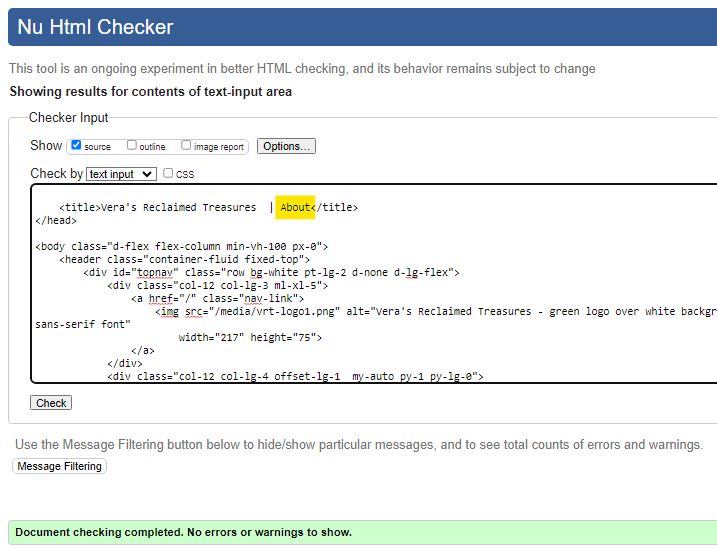

Shop, Product Details & Review Pages

 

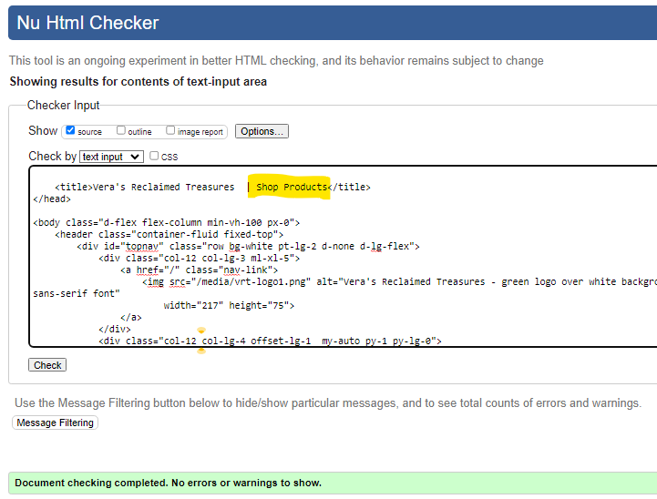

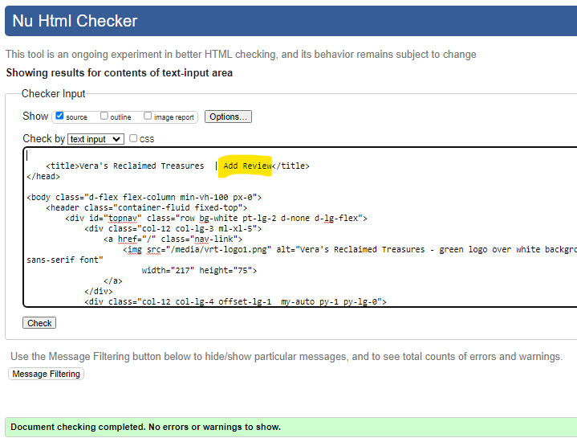

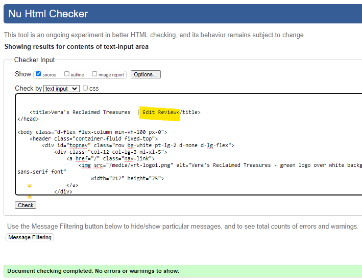

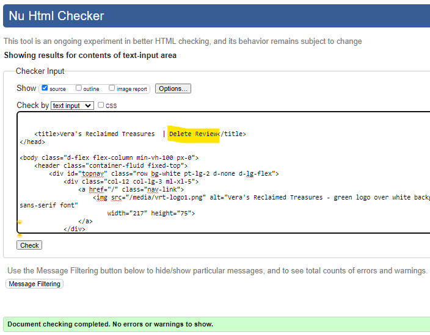

Basket & Checkout Pages

 

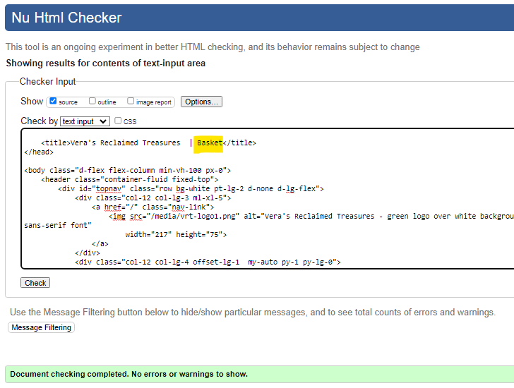

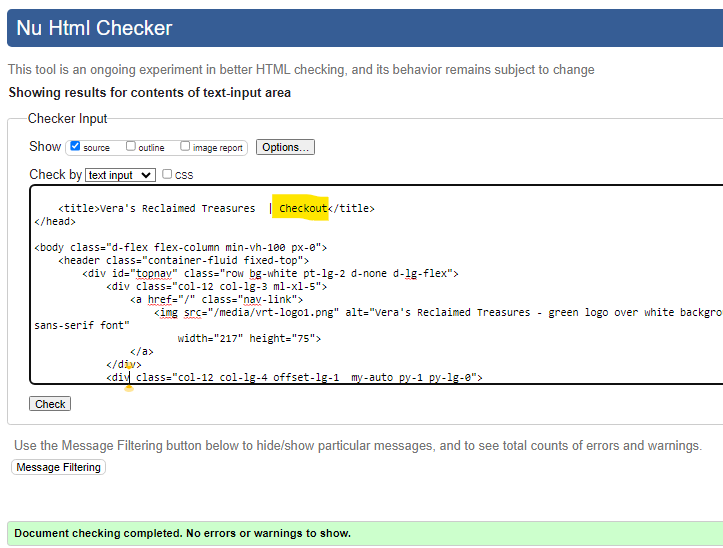

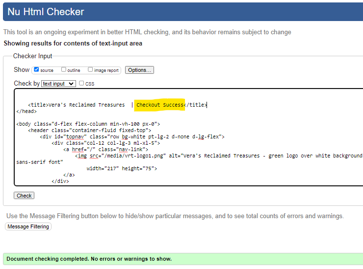

Profile & Contact Pages

 

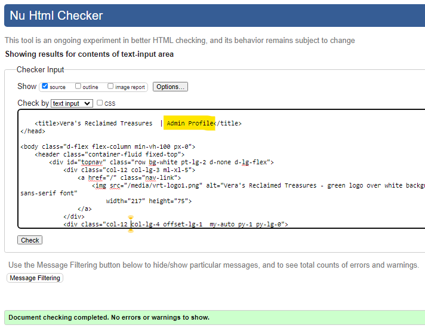

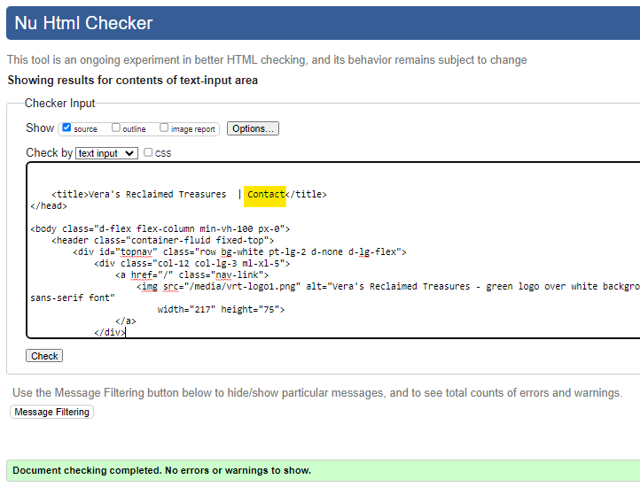

Signup, Login & Logout Pages

 

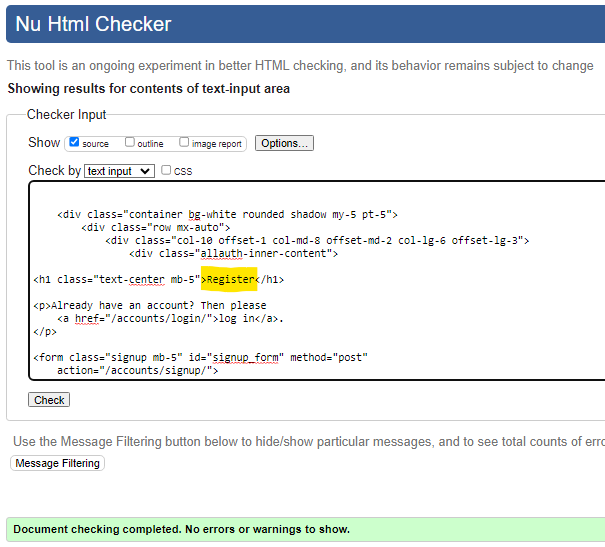

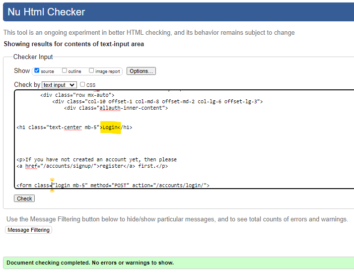

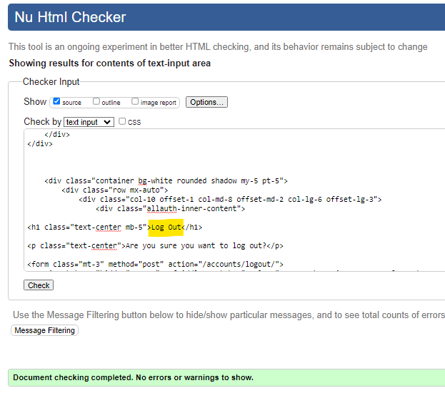

Error Pages

 

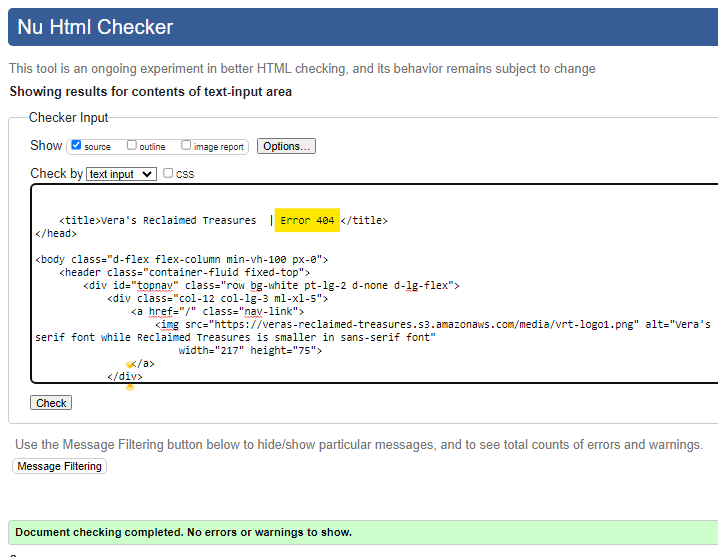

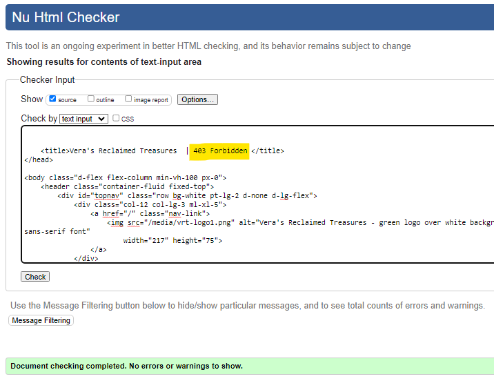

[Back To Top](#table-of-contents)

_____

## CSS

CSS code was tested using the [W3C CSS Validation Service](https://jigsaw.w3.org/css-validator/) via text input. 

Screenshot with results for the styles.css file

 

[Back To Top](#table-of-contents)
_____

## Python

Python code was tested using [Code Institute's Python Linter](https://pep8ci.herokuapp.com/).

Long lines in `settings.py` and `env.py` were cleared using `# noqa`. These were values by the Django generated AUTH_PASSWORD_VALIDATORS and the long password values.

[Back To Top](#table-of-contents)
_____

## JavaScript

[Back To Top](#table-of-contents)

_____

# Lighthouse

[Back To Top](#table-of-contents)

_____

# Responsiveness

[Back To Top](#table-of-contents)

_____

# Browser Compatibility

[Back To Top](#table-of-contents)

_____

# User Stories

[Back To Top](#table-of-contents)

_____

# Features

[Back To Top](#table-of-contents)

_____
