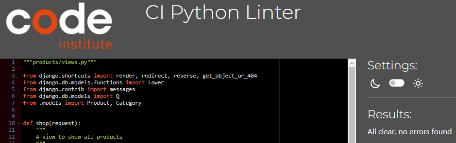
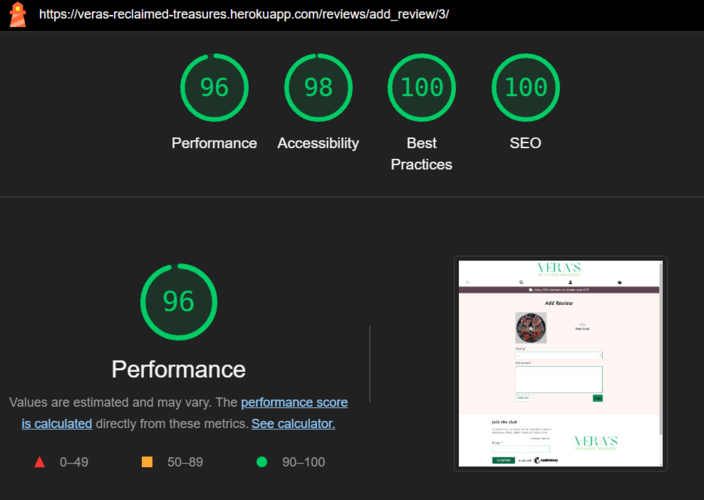
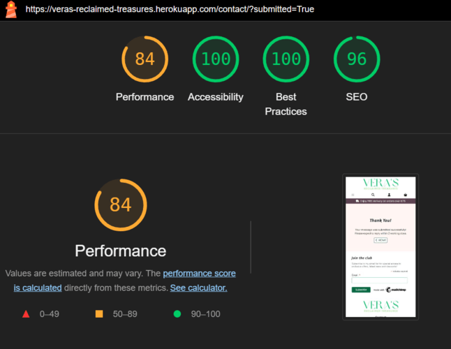

# Table of Contents

- [Table of Contents](#table-of-contents)
- [Code Validation](#code-validation)
  - [HTML](#html)
  - [CSS](#css)
  - [Python](#python)
  - [JavaScript](#javascript)
- [Lighthouse](#lighthouse)
- [Responsiveness](#responsiveness)
- [Browser Compatibility](#browser-compatibility)
- [User Stories](#user-stories)
- [Features](#features)

_____

# Code Validation

## HTML

HTML code was tested using the [W3C Validator](https://validator.w3.org/) via text input. Each page's source code was copied and pasted into the validator and checked for errors and warnings.

Home & About Pages

 

Shop, Product Details & Review Pages

 

Basket & Checkout Pages

 

Profile & Contact Pages

 

Signup, Login & Logout Pages

 

Error Pages

 

[Back To Top](#table-of-contents)

_____

## CSS

CSS code was tested using the [W3C CSS Validation Service](https://jigsaw.w3.org/css-validator/) via file input.  No errors found, warnings due to vendor prefixes.

Screenshot with results for the styles.css file

 

BASE STYLESHEET

PRODUCTS STYLESHEET

CHECKOUT STYLESHEET

PROFILE STYLESHEET

CONTACT STYLESHEET

ABOUT STYLESHEET

[Back To Top](#table-of-contents)
_____

## Python

Python code was tested using [Code Institute's Python Linter](https://pep8ci.herokuapp.com/).

Long lines in 'settings.py' and 'env.py' were cleared using `# noqa`. These were values by the Django generated `AUTH_PASSWORD_VALIDATORS` and the long password values in 'env.py'.

Main App & custom_storages.py

 

Home App

 

Profiles App

 

Products App

 

Basket App

 

Checkout App

 

Reviews App

 

Contact App

 

[Back To Top](#table-of-contents)
_____

## JavaScript

[JShint](https://jshint.com/) was used to validate customised scripts. No Errors or warnings were flagged.

Screenshots available here

 

**Script in basket.html**

**Modified quantity_input_script.html**

**Slightly modified countryfield.js file**

**Slightly modified stripe_elements.js file**

[Back To Top](#table-of-contents)

_____

# Lighthouse

[Lighthouse](https://developer.chrome.com/docs/lighthouse/overview/) was used to audit the website for performance, accessibility, best practice and SEO.  This was run in Chrome DevTools in incognito mode.

Home Page

 

MOBILE

Low performance score due to render blocking resources and unused javascript.
Render blocking resources included the Bootstrap suit with the highest transfer size.  Coverage was used to identify critical CSS and JS but due to time constraints, these could not be eliminated.
Stripe was flagged as unused JS, however it was decided to leave this in the base.html as recommended by Stripe documentation to manage fraudulent activity.

DESKTOP

Shop Page

 

MOBILE

Low performance score due to use of HTTP/1. Recommendation to use HTTP/2 with Amazon Web services. This is out of my control and could not switch at this stage.
Unused JavaScript - once again Stripe was flagged highest for this. Stripe recommends to place the JS link in the base.html to prevent fraudulent activity.

DESKTOP

Product Detail Page & Review Forms

 

PRODUCT DETAIL MOBILE

Low performance score due to render blocking resources and unused javascript.

PRODUCT DETAIL DESKTOP

ADD REVIEW MOBILE

Low performance score due to unused javascript and render blocking resources.

ADD REVIEW DESKTOP

EDIT REVIEW MOBILE

EDIT REVIEW DESKTOP

DELETE REVIEW CONFIRMATION MOBILE

DELETE REVIEW CONFIRMATION DESKTOP

Profile Page

 

MOBILE

DESKTOP

About Page

 

MOBILE

Low performance score due to unused javascript, render blocking resources and use of HTTP1.

DESKTOP

Basket Page

 

MOBILE

DESKTOP

Checkout & Checkout Success Pages

 

CHECKOUT PAGE MOBILE

CHECKOUT PAGE DESKTOP

CHECKOUT SUCCESS MOBILE

CHECKOUT SUCCESS DESKTOP

Contact & Contact Success Page

CONTACT MOBILE

CONTACT DESKTOP

CONTACT SUCCESS MOBILE

CONTACT SUCCESS DESKTOP

Signup, Login & Logout

 

SIGNUP MOBILE

SIGNUP DESKTOP

LOGIN MOBILE

LOGIN DESKTOP

LOGOUT MOBILE

LOGOUT DESKTOP

[Back To Top](#table-of-contents)

_____

# Responsiveness

[Back To Top](#table-of-contents)

_____

# Browser Compatibility

[Back To Top](#table-of-contents)

_____

# User Stories

[Back To Top](#table-of-contents)

_____

# Features

[Back To Top](#table-of-contents)

_____
