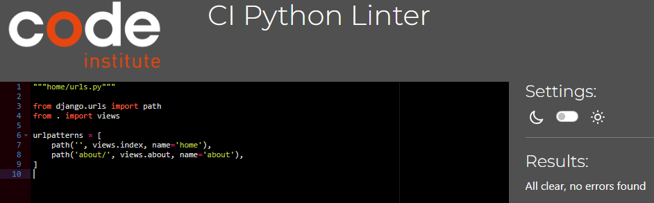

# Table of Contents

- [Table of Contents](#table-of-contents)
- [Code Validation](#code-validation)
  - [HTML](#html)
  - [CSS](#css)
  - [Python](#python)
  - [JavaScript](#javascript)
- [Lighthouse](#lighthouse)
- [Responsiveness](#responsiveness)
- [Browser Compatibility](#browser-compatibility)
- [User Stories](#user-stories)
- [Features](#features)

_____

# Code Validation

## HTML

HTML code was tested using the [W3C Validator](https://validator.w3.org/) via text input. Each page's source code was copied and pasted into the validator and checked for errors and warnings.

Home & About Pages

 

Shop, Product Details & Review Pages

 

Basket & Checkout Pages

 

Profile & Contact Pages

 

Signup, Login & Logout Pages

 

Error Pages

 

[Back To Top](#table-of-contents)

_____

## CSS

CSS code was tested using the [W3C CSS Validation Service](https://jigsaw.w3.org/css-validator/) via file input.  No errors found, warnings due to vendor prefixes.

Screenshot with results for the styles.css file

 

BASE STYLESHEET

PRODUCTS STYLESHEET

CHECKOUT STYLESHEET

PROFILE STYLESHEET

CONTACT STYLESHEET

ABOUT STYLESHEET

[Back To Top](#table-of-contents)
_____

## Python

Python code was tested using [Code Institute's Python Linter](https://pep8ci.herokuapp.com/).

Long lines in 'settings.py' and 'env.py' were cleared using `# noqa`. These were values by the Django generated `AUTH_PASSWORD_VALIDATORS` and the long password values in 'env.py'.

Main App & custom_storages.py

 

Home App

 

Profiles App

 

Products App

 

Basket App

 

Checkout App

 

Reviews App

 

Contact App

 

[Back To Top](#table-of-contents)
_____

## JavaScript

[JShint](https://jshint.com/) was used to validate customised scripts. No Errors or warnings were flagged.

Screenshots available here

 

**Script in basket.html**

**Modified quantity_input_script.html**

**Slightly modified countryfield.js file**

**Slightly modified stripe_elements.js file**

[Back To Top](#table-of-contents)

_____

# Lighthouse

[Lighthouse](https://developer.chrome.com/docs/lighthouse/overview/) was used to audit the website for performance, accessibility, best practice and SEO.  This was run in Chrome DevTools in incognito mode.

Home Page

 

MOBILE

Low performance score due to render blocking resources and unused javascript.
Render blocking resources included the Bootstrap suit with the highest transfer size.  Coverage was used to identify critical CSS and JS but due to time constraints, these could not be eliminated.
Stripe was flagged as unused JS, however it was decided to leave this in the base.html as recommended by Stripe documentation to manage fraudulent activity.

DESKTOP

Shop Page

 

MOBILE

Low performance score due to use of HTTP/1. Recommendation to use HTTP/2 with Amazon Web services. This is out of my control and could not switch at this stage.
Unused JavaScript - once again Stripe was flagged highest for this. Stripe recommends to place the JS link in the base.html to prevent fraudulent activity.

DESKTOP

Product Detail Page & Review Forms

 

PRODUCT DETAIL MOBILE

Low performance score due to render blocking resources and unused javascript.

PRODUCT DETAIL DESKTOP

ADD REVIEW MOBILE

Low performance score due to unused javascript and render blocking resources.

ADD REVIEW DESKTOP

EDIT REVIEW MOBILE

EDIT REVIEW DESKTOP

DELETE REVIEW CONFIRMATION MOBILE

DELETE REVIEW CONFIRMATION DESKTOP

Profile Page

 

MOBILE

DESKTOP

About Page

 

MOBILE

Low performance score due to unused javascript, render blocking resources and use of HTTP1.

DESKTOP

Basket Page

 

MOBILE

DESKTOP

Checkout & Checkout Success Pages

 

CHECKOUT PAGE MOBILE

CHECKOUT PAGE DESKTOP

CHECKOUT SUCCESS MOBILE

CHECKOUT SUCCESS DESKTOP

Contact & Contact Success Page

CONTACT MOBILE

CONTACT DESKTOP

CONTACT SUCCESS MOBILE

CONTACT SUCCESS DESKTOP

Signup, Login & Logout

 

SIGNUP MOBILE

SIGNUP DESKTOP

LOGIN MOBILE

LOGIN DESKTOP

LOGOUT MOBILE

LOGOUT DESKTOP

[Back To Top](#table-of-contents)

_____

# Responsiveness

[Back To Top](#table-of-contents)

_____

# Browser Compatibility

[Back To Top](#table-of-contents)

_____

# User Stories

As mentioned in the Agile Methodology Section in the [README](readme.md), User Stories were created in [GitHub Issues]( https://github.com/MoniPar/reclaimed-treasures/issues) which guide the process for the development of this project.  Each User Story has been manually tested and the results have been collected in the tables below.  They have been organized by their respective Epics.  Please note that Epic 1 – Initial Setup, is not included in this section as it defines setup and installation.

Landing Page and Navigation

 

[User Story #11](https://github.com/MoniPar/reclaimed-treasures/issues/11)

As a User, I can land on the homepage of the site, so that I can learn more about the business and the types of products they sell.

|Acceptance Criteria | Test | Comments |
|---------------------------|-------|----------------|
|Website's URL directs user to the homepage | Achieved | |
|The Homepage has a clear overview of what the site is about | Achieved | |

[User Story #12](https://github.com/MoniPar/reclaimed-treasures/issues/12)

As a User, I can view the logo and the links in the navigation bar, so that I can easily navigate to other pages of the site.

| Acceptance Criteria | Test | Comments |
|---------------------------|-------|----------------|
| The header is displayed at the top of the page across all pages of the website | Achieved | |
|The main header displays the logo, links, search bar, account and shopping basket icons | Achieved | |
| Links to the other pages of the site can be easily accessed by all users | Achieved | Profile page can only be accessed by registered users |
| Hamburger button for mobile toggles navbar links | Achieved | |

[User Story #13](https://github.com/MoniPar/reclaimed-treasures/issues/13)

As a User, I can access contact details, social and developer links across all pages, so that I can follow/contact the business owner and the website creator.

| Acceptance Criteria | Test | Comments |
|---------------------------|-------|----------------|
| The footer is displayed at the bottom of the page across all pages of the website | Achieved | |
| Contact details and social links are clearly displayed on all screen sizes | Achieved | |
| Social links and privacy policy open in a new tab | Achieved | |
| Copyright date and link to website’s creator profile is included at the bottom | Achieved | |
| Contact link and newsletter signup are included at the top | Achieved | Contact link has been included with the useful links |

[User Story #14](https://github.com/MoniPar/reclaimed-treasures/issues/14)

As a business owner, I can have a banner with a CTA clearly visible on the landing page, so that users are encouraged to access the shop and view/buy products.

| Acceptance Criteria | Test | Comments |
|---------------------------|-------|----------------|
| A hero image that draws the eye and gives the user a visual representation of the artist’s designs | Achieved | |
| An overlay with text which encapsulates what the business is about | Achieved | |
| A visible Shop Now button which links to the Shop/Products page | Achieved | |

[User Story #15](https://github.com/MoniPar/reclaimed-treasures/issues/15)

As a User, I can read about the business, so that I can decide if I want to purchase from them or not.

| Acceptance Criteria | Test | Comments |
|---------------------------|-------|----------------|
| A short section about the products | Achieved | |
| A short section about the process | Achieved | |
| A link to more information which will lead to the About page | Achieved | |

[User Story #16](https://github.com/MoniPar/reclaimed-treasures/issues/16)

As a business owner, I can choose which products to feature on the landing page, so that users are encouraged to check them out.

| Acceptance Criteria | Test | Comments |
|---------------------------|-------|----------------|
| A products section which displays at least three categories of products | Yet to Achieve | |
| Each product is displayed on a card with name, image and a button which leads to the shop | Yet to Achieve | |

 

User Registration & Authorisation

 

[User Story #7](https://github.com/MoniPar/reclaimed-treasures/issues/7)

As a User, I can register for an account so that I have access to other features of the website.

| Acceptance Criteria | Test | Comments |
|---------------------------|-------|----------------|
| A user can register for an account using a username, email and password | Achieved | |

[User Story #8](https://github.com/MoniPar/reclaimed-treasures/issues/8)

As a User, I can check my emails for a registration confirmation email, so that I can verify that my registration was successful.

| Acceptance Criteria | Test | Comments |
|---------------------------|-------|----------------|
| The user is asked to verify their email address upon registration | Achieved | |
| The user is directed to a temporary success URL if the email is verified | Achieved | |

[User Story #9](https://github.com/MoniPar/reclaimed-treasures/issues/9)

As a User, I can login and logout from my account, so that I can access my account’s information and keep my information secure.

| Acceptance Criteria | Test | Comments |
|---------------------------|-------|----------------|
| User is able to login to their account with their username and password | Achieved | |
| User is able to logout from their account | Achieved |

[User Story #10](https://github.com/MoniPar/reclaimed-treasures/issues/10)

As a User, I can reset my password, so that I can regain access to my account.

| Acceptance Criteria | Test | Comments |
|---------------------------|-------|----------------|
| User is able to reset their password by entering their email address | Achieved | |
| User receives email with a link directing them to the reset password form  | Achieved | |

[User Story #19](https://github.com/MoniPar/reclaimed-treasures/issues/19)

As a User, I can connect with my social media account, so that I can create an account.

| Acceptance Criteria | Test | Comments |
|---------------------------|-------|----------------|
| User can register using their Facebook account | Yet to Achieve | |

 

Product Management

 

[User Story #20](https://github.com/MoniPar/reclaimed-treasures/issues/20)

As a Shop Owner, I can use the Admin interface to add, update, view and delete products so that I can populate the online shop.

| Acceptance Criteria | Test | Comments |
|---------------------------|-------|----------------|
|The ability to add, update, view and delete categories in the admin panel | Achieved | |
|The ability to add products and their relative information and images via the admin panel | Achieved | |
|The ability to view a list of products, update and delete specific products via the admin panel | Achieved | |

[User Story #21](https://github.com/MoniPar/reclaimed-treasures/issues/21)

As a Store Owner, I can add a product via the User interface, so that I can add new items to my store.

|Acceptance Criteria | Test | Comments |
|---------------------------|-------|----------------|
| Store owner is able to add products to the store via a form on the frontend | Yet to Achieve | For now this can be done via the Admin interface |

[User Story #22](https://github.com/MoniPar/reclaimed-treasures/issues/22)

As a Store Owner, I can edit/update a product, so that I can change the product price, description, image and other product criteria.

|Acceptance Criteria | Test | Comments |
|---------------------------|-------|----------------|
| The Store Owner is able to update a product through a form on the frontend | Yet to achieve | For now this can be done via the Admin interface |

[User Story #23](https://github.com/MoniPar/reclaimed-treasures/issues/23)

As a Store Owner, I can delete a product, so that I can remove items that are no longer on sale.

|Acceptance Criteria | Test | Comments |
|---------------------------|-------|----------------|
| The Store Owner is able to delete a product via a form on the frontend | Yet to achieve | For now this can be done via the Admin interface |
|The Store Owner is able to update and delete a product via the quick links | Yet to achieve | For now updating and deleting products can only be done via the Admin interface |
|Only the Store Owner/Superuser is able to access this functionality | N/A | There is no functionality to test |

 

Product Viewing & Navigation

 

[User Story #24](https://github.com/MoniPar/reclaimed-treasures/issues/24)

As a Customer, I can view a list of products so that I can select some to purchase.

|Acceptance Criteria | Test | Comments |
|---------------------------|-------|----------------|
| The customer is able to see a list of products in the Shop/Products page | Achieved | |
| Each product card displays an image, name, price, category, pattern, rating and link  | Achieved | |
| The customer is able to view a specific category of products | Achieved | |
| The customer is able to quickly identify deals and new products | Achieved | |

[User Story #25](https://github.com/MoniPar/reclaimed-treasures/issues/25)

As a Customer, I can view individual product details, so that I can identify more information about the product.

|Acceptance Criteria | Test | Comments |
|---------------------------|-------|----------------|
| The customer is able to click on each individual product's image or link “view detail” to view more details about the product | Achieved | |
| The product detail page includes the product's description, additional info, stock status as well as quantity selector buttons and add to basket button | Achieved | Also a highlighted notice on Made to Order Products & a disabled “Not Available” button instead of the quantity selector buttons on products that are not available|
| The customer is able to see any available reviews on the product made by other customers or themselves | Achieved | |

[User Story #26](https://github.com/MoniPar/reclaimed-treasures/issues/26)

As a Customer, I can search for a specific product or view a category of products, so that I can quickly find products I'm interested in.

|Acceptance Criteria | Test | Comments |
|---------------------------|-------|----------------|
| Customer is able to search for a product by name | Achieved | |
| Customer is able to search for a product by other keywords found in the description | Achieved | |
| Customer is able to see what they've searched for and the number of results | Achieved | |
| Customer can return back to the shop page using the link at the front of the product count | Achieved | |
| Customer is able to see which category they have selected | Achieved | |

[User Story #27](https://github.com/MoniPar/reclaimed-treasures/issues/27)

As a Customer, I can sort the list of available products, so that I can easily identify the best rated & best priced categorically sorted products.
|Acceptance Criteria | Test | Comments |
|---------------------------|-------|----------------|
| User can sort all products as well as categories of products in desc and asc order | Achieved | |
| User can sort products by price in desc and asc order | Achieved | |
| User can sort products by rating in desc and asc order | Achieved | |
| User can sort products by name in desc and asc order | Achieved | |
| User can sort products by theme in desc and asc order | Achieved | |
| User can sort all products by category in desc and asc order| Achieved | |
| User can sort all products by availability in desc and asc | Partially Achieved | Not available products do not take precedence over made to order products yet |

[User Story #46](https://github.com/MoniPar/reclaimed-treasures/issues/46)

As a User, I can check products' reviews, so that I can make up my mind if I want to purchase the product.
As a Registered User, I can add a review, so that I can submit my feedback about a product.

|Acceptance Criteria | Test | Comments |
|---------------------------|-------|----------------|
| Users are able to see ratings for products in the shop | Achieved | Products that haven't yet been rated are marked as “No Rating” |
| Users are able to see reviews, if any, on each product's detail page | Achieved | |
| Registered users are able to rate and submit reviews of products | Achieved | |
| Registered customers are able to rate and submit reviews of products they have purchased | Achieved | |

[User Story #48](https://github.com/MoniPar/reclaimed-treasures/issues/48)

As a Customer, I can edit and delete my reviews, so that I have the ability to correct any mistakes I make.

|Acceptance Criteria | Test | Comments |
|---------------------------|-------|----------------|
| Registered customers can edit their submitted reviews | Achieved | |
| Registered customers can delete their submitted reviews | Achieved | |

[User Story #52]( https://github.com/MoniPar/reclaimed-treasures/issues/52)

As a User, I can easily navigate back to  the top of the page with one click, so I can easily access other parts of the website.

This User Story has been marked as won't have at this time as the user can easily navigate to other parts of the website because the Navigation bar is always fixed on top.

 

User Profile

 

[User Story #42](https://github.com/MoniPar/reclaimed-treasures/issues/42)

As a Registered Customer, I can have a personal user profile, so that I can save my payment info and view my order history and confirmations.

|Acceptance Criteria | Test | Comments |
|---------------------------|-------|----------------|
| A User profile is automatically created for the user upon registration | Achieved | | 
| Registered users are able to access their profile through the link in the navbar | Achieved | |
| Registered users are able to logout from their profile through the link in the navbar | Achieved | |

[User Story #43](https://github.com/MoniPar/reclaimed-treasures/issues/43)

As a Customer, I can edit personal information on my profile, so that I can use the correct details when processing future orders.

|Acceptance Criteria | Test | Comments |
|---------------------------|-------|----------------|
| The customer is able to update their personal information on their profile | Achieved | |
| The customer is able to see a history of their orders in their profile | Achieved | |
| The information saved in the profile can be retrieved in the Checkout form, if the user checks the save info box | Achieved | | 

 

Shopping Basket

 

[User Story #29](https://github.com/MoniPar/reclaimed-treasures/issues/29)

As a customer, I can access my basket so I can review items before I purchase them.

|Acceptance Criteria | Test | Comments |
|---------------------------|-------|----------------|
|Customer is able to access the basket page via the main navigation | Achieved | |
| Customers who have added products to their basket will be able to see the products | Achieved | |
| Customers who have not yet added products will see some text and a link to the shop | Achieved | |

[User Story #30](https://github.com/MoniPar/reclaimed-treasures/issues/30)

As a developer, I can create a context processor, so that I can access the basket related variables from other apps in my project.

This User Story should have been marked as a developer task.

[User Story #31](https://github.com/MoniPar/reclaimed-treasures/issues/31)

As a customer, I can add items and identify the total cost in the basket, so that I know how much I'm spending.

|Acceptance Criteria | Test | Comments |
|---------------------------|-------|----------------|
| The customer can add items to their basket | Achieved | |
| The customer can easily return back to the shop page from the basket page | Achieved | |
| The customer can view the subtotal and total sum of the items in their basket | Achieved | |

[User Story #32](https://github.com/MoniPar/reclaimed-treasures/issues/32)

As a developer, I can add functionality with the plus (+) and (-) buttons on the quantity selector, so that the user has a better experience adding products to their basket.

|Acceptance Criteria | Test | Comments |
|---------------------------|-------|----------------|
| The customer is able to use buttons to increase/decrease the quantity of the products they want to order from the product detail page | Achieved | |
| The customer is able to use buttons to increase/decrease the quantity of the products they want to order from the basket page | Achieved | |
| Using buttons the customer is only able to add up to 3 items on products that are Made to Order from the product detail page | Achieved | |
| Using buttons the customer is only able to add up to 3 items on products that are Made to Order from the basket page | Achieved | |

[User Story #33](https://github.com/MoniPar/reclaimed-treasures/issues/33)

As a Customer, I can update the quantity of each item in my basket, so that I can easily make changes to my order before checkout.

|Acceptance Criteria | Test | Comments |
|---------------------------|-------|----------------|
| The customer is able to update the quantity of each item in their basket via the update link | Achieved | |
| The customer is able to remove a product from their basket via the remove link | Achieved | |
| The customer is able to see the subtotal for the amount of each product in their basket | Achieved | |

[User Story #34](https://github.com/MoniPar/reclaimed-treasures/issues/34)

As a User, I can see real-time notifications as I interact with the website, so that I can have a better experience.

|Acceptance Criteria | Test | Comments |
|---------------------------|-------|----------------|
| The User is provided with neat and clear notifications when using functional features of the site | Achieved | |
| The notifications are designed to display the result of the user's interaction | Achieved | |

 

Checkout

 

[User Story #35](https://github.com/MoniPar/reclaimed-treasures/issues/35)

As a developer, I can create a checkout app, so that I can implement functionality for the customer to enter information and view their delivery cost, order and grand total.

This user story should have been marked as a developer task.

[User Story #36](https://github.com/MoniPar/reclaimed-treasures/issues/36)

As a customer, I can confirm my items and total cost in the checkout page, so that I can continue to enter the required information to complete my order.

|Acceptance Criteria | Test | Comments |
|---------------------------|-------|----------------|
| Customer is able to view the items they want to order | Achieved | |
| Customer is able to view the order cost, delivery cost and grand total | Achieved | |
| Customer is easily able to enter their information and delivery/billing address in the required fields | Achieved | |
| Customer can go back to the basket page to add, replace or delete items | Achieved | |

[User Story #37](https://github.com/MoniPar/reclaimed-treasures/issues/37)

As a developer, I can use Stripe Elements, so that I can setup a secure payment system to the online shop.

|Acceptance Criteria | Test | Comments |
|---------------------------|-------|----------------|
| A payment field matching all other fields is displayed on the checkout page | Achieved | |
| The payment field required a card number, expiration date and cvc (poscode for US) | Achieved | |
| An invalid card number turns red | Achieved | An error msg is also displayed |

[User Story #38](https://github.com/MoniPar/reclaimed-treasures/issues/38)

As a Customer, I can easily enter my payment information, so that I can checkout quickly and efficiently.

|Acceptance Criteria | Test | Comments |
|---------------------------|-------|----------------|
| The form is submitted by entering any test card number and any other digits for the rest | Achieved | |
| A successful payment notification is displayed in Stripe/developers/events | Achieved | | 

[User Story #39](https://github.com/MoniPar/reclaimed-treasures/issues/39)

As a customer, I can view an order confirmation after checkout, so that I can confirm that my order was successful.

|Acceptance Criteria | Test | Comments |
|---------------------------|-------|----------------|
| The customer is able to see their products and totals in the checkout page | Achieved | | 
| The customer is alerted to enter required fields in the checkout form | Achieved | |
| If the form is valid the customer is able to checkout using the test card number | Achieved | |
| The customer is then directed to the checkout success page where they can see their order summary | Achieved | See Checkout Success Image below |
| Stripe shows payment intent succeeded | Achieved | See Payment Intent Succeeded below |
| The order is created with all the expected lineitems and the order in the admin panel | Achieved |See Order & Line Items below |
| The stock (on products in stock) is deducted on the product table in the admin panel | Achieved | |

VRT Checkout Success

 

 

Stripe Payment Intent Succeeded

 

 

Admin Order & Line Items

 

 

Test results for a typical successful order

 

|Acceptance Criteria | Test | Comments |
|--------------------|------|----------|
| A loading modal informs the user that the transaction is being processed | Achieved | |
| The Order Success Confirmation page is displayed with order details | Achieved | |
| The payment intent is successfully created in Stripe printing out “verified order already in the database” | Achieved | |
| The order is submitted to the DB | Achieved | |
| The stock is decremented | Achieved | |
| The basket is cleared | Achieved | |
| Order confirmation can be found in registered user’s profile | Achieved | |
| Confirmation email received | Achieved | |

 

[User Story #40](https://github.com/MoniPar/reclaimed-treasures/issues/40)

As a developer, I can make sure that customers can confidently provide the information required safely and securely so that they can have a positive experience on the site.

Webhook handler for issues during checkout transactions tested in *development*: Simulated by commenting out `form.submit()` in stripe_elements.js

|Acceptance Criteria | Test | Comments |
|---------------------------|-------|----------------|
| A loading modal informs the user that the transaction is being processed | Achieved | |
| The payment intent is successfully created in Stripe printing out "Created order in webhook" | Achieved | |
| The order is submitted to the DB | Achieved | |
| The stock is decremented | Yet to Achieve | |
| The basket is cleared | Yet to Achieve | |
| Order confirmation can be found in registered user's profile | Achieved | |
| Confirmation email received | Achieved | |

Webhook handler for issues during checkout transactions tested in *production*: Simulated by closing the website before checkout success page is displayed. Two different outcomes from the number of tests undertaken:

| Criteria | Outcome 1 | Outcome 2 |
|----------|-----------|-----------|
| A loading modal informs the user that the transaction is being processed | Achieved | Achieved |
| User closes the tab before checkout success page is displayed | Achieved | Achieved |
| The payment intent is successfully created in Stripe printing out “Created order in Webhook” | Not Achieved - “Verified order already in the database” | Achieved | 
| The order is submitted to the DB | Achieved | Achieved |
| The stock is decremented | Achieved | Not Achieved |
| The basket is cleared | Achieved | Not Achieved |
| Order confirmation can be found in registered user's profile | Not Achieved | Achieved |
| Confirmation email received | Achieved | Achieved |

[User Story #41](https://github.com/MoniPar/reclaimed-treasures/issues/41)

As a developer, I can decrement stock on payment success, so that I can add functionality when item becomes out of stock.

|Acceptance Criteria | Test | Comments |
|---------------------------|-------|----------------|
| “Stock: (no. of stock)” is displayed on the UI on each product detail | Achieved | |
| Product stock is decremented upon normal successful order | Achieved | Yet to achieve when order is created in webhook |
| When product stock is 0, the “Stock: (no. of stock)” on the UI changes to “Made to Order” | Achieved | |
| Max quantity one can order on products that have sufficient stock is 10 | Achieved | |
| Max quantity one can order on Made to Order products is 3 | Achieved | | 
| Max quantity overflow one can order on products that have insufficient stock is 3   | Achieved | |

[User Story #44](https://github.com/MoniPar/reclaimed-treasures/issues/44)
As a customer, I can receive email confirmation after checkout, so that I can keep the confirmation of the transaction for my records.
|Acceptance Criteria | Test | Comments |
|---------------------------|-------|----------------|
| The customer receives a confirmation email of their order | Achieved | |
| The registered customer is able to view their order history in their profile even if the checkout success page fails | Mixed Results | See [User Story #40](https://github.com/MoniPar/reclaimed-treasures/issues/40) |

 

SEO & WebMarketing

 

[User Story #18](https://github.com/MoniPar/reclaimed-treasures/issues/18)

As a user, I can sign up to the website’s newsletter so that I can keep updated with the latest news, offers, products and pop up stalls.

|Acceptance Criteria | Test | Comments |
|---------------------------|-------|----------------|
| A Newsletter email signup form is displayed on the footer | Achieved | |
| When user enters email address and hits subscribe, a success message is displayed below the field | Achieved | |
| Email address is recorded on the Mailchimp account | Achieved |

[User Story #50](https://github.com/MoniPar/reclaimed-treasures/issues/50)

As a business owner, I can have my Facebook business page linked with my website, so that I can connect and interact with my customers directly and potentially extend my reach through posts and other content creation. 

|Acceptance Criteria | Test | Comments |
|---------------------------|-------|----------------|
| Website users can access the Facebook page through the link in the footer and on the contact page | Achieved | |
| Facebook users can access the website through the link on the Facebook account and posts | Achieved| |
| Facebook page has relevant information about the business, including keywords used through the website | Achieved | |

[User Story #50](https://github.com/MoniPar/reclaimed-treasures/issues/50)

As a developer, I can add metadata, a sitemap and robots.txt file so that the website can be found and ranked by search engines.

|Acceptance Criteria | Test | Comments |
|---------------------------|-------|----------------|
| The description & relevant keywords and titles are included on the main pages of the website’s metatags | Achieved | |
| A sitemap.xml file is included in the project’s root folder | Achieved | |
| A robots.txt file is also included in the project’s root folder | Achieved | |

 

Other Features

 

[User Story #47](https://github.com/MoniPar/reclaimed-treasures/issues/47)

As a user, I can navigate to the About page, so that I can learn more about the shop owner and her business.

|Acceptance Criteria | Test | Comments |
|---------------------------|-------|----------------|
| User can easily navigate to the About page from the navigation link and the About me link on the Home page | Achieved | | 
| An image of the shop owner is displayed here | Achieved | |
| Information about the shop owner and her business are displayed here | Achieved | |
| A CTA with a link to the shop | Achieved | Carousel slide |
| A card with a link to the contact page | Achieved | Carousel slide |

[User Story #17](https://github.com/MoniPar/reclaimed-treasures/issues/17)

As a user, I can quickly write a message to the business owner using the contact form, so that I can ask questions or give feedback.

|Acceptance Criteria | Test | Comments |
|---------------------------|-------|----------------|
| Contact page displays hero with a heading inviting users to get in touch | Achieved | |
| Some text with info about why should users get in touch is displayed | Achieved | |
| Contact info including: phone, email, social links are also included here | Achieved | |
| Social links open in a new tab | Achieved | | 
| A Contact form with fields for: Subject, email, phone no., and message box are displayed | Achieved | |
| User is alerted to any missing information when they try to submit the form with empty required fields | Achieved | |
| When form is valid, user is directed to a Thank You page with a message and a link to the Home Page | Achieved | |
| Form information is recorded in the DB | Achieved | |
| Shop owner receives an email with subject, user's name, email, phone and message | Achieved | See image below |

<detail>

Contact form query alert email

 

 
</detail>

[User Story #55](https://github.com/MoniPar/reclaimed-treasures/issues/55)

As a developer, I can build custom error pages, so that the user remains on the site and has a way to get back to the homepage or access navigation.

|Acceptance Criteria | Test | Comments |
|---------------------------|-------|----------------|
| Custom error pages have styles that match the website | Achieved | |
| The pages define the error and display a button which brings the user back to the homepage | Achieved | |

 

[Back To Top](#table-of-contents)

_____

# Features

[Back To Top](#table-of-contents)

_____
